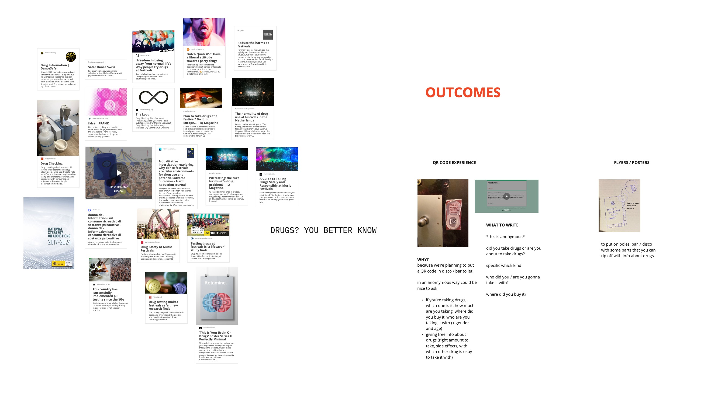

#A new design space

At the end of the first term, I had to reflect on the evolution of my design space. This is the beginning, where I'm standing at the very start of second term. I have many inspirations, different fields that I wanna explore and people I'd love to collaborate with.

**SOME IDEAS, FIELDS, PROJECTS, OPPORTUNITIES**

- clay
- drugs
- water
- bio dinner

#Clay

If I have to think what I'm passionate about I'd start with clay and pottery.
During my last year of bachelor I had to do an internship. Covid just happened and after months of online lessons I couldn't not spend one more minute in front of my laptop.
That's why I decided to knock the door of a pottery studio called Unomi, in Turin, Italy.
Cristina, the owner of the lab and an amazing artisan taught me everything, not just how to spin the wheel, but how to deal with a studio that works with students who are learning, with clients and with restaurants who want specific shapes and specific color for each plate.
I worked at **Unomi** for two years and it changed myself and my life.
When I moved to Barcelona I decided not to give up on that and brought with me my spin wheel to share my passion with others.
I think it's what I like to do the most.

When MDEF started, I decided to leave the ceramic aside for a moment, in order to give myself the opportunity to focus also on other interest that I have.
Then I met Marc, our Catalan classmate also interested in clay and more specifically in traditional techniques and local clay.
At the beginning of November we went together to La Bisbal, a small town close to Girona famous for its artisans, industries and clay. We discovered around, went to factories, small artisans shops and museums. It was inspiring to me seeing how different are the methods that are traditional over there, compared to what I consider traditional! While in Rome...

Anyways, the trip to la Bisbal made me feel the urge to explore also clay as a possible design intervention field.
Also, during the Tech Beyond the Myth week we had the chance to go visit Transfolab, which became part of the ideal process... but I'll talk about it later.

So here I am. For now, I will participate to Marc's intervention, to support and help him out when needed, while developing my own concept.

I think it's exciting and scaring at the same time to open it up as a project, but I feel like there are some needs in the ceramic field that are to be satisfied.

A problem that many ceramist artisans experience and that I experienced in the first place while working at Unomi, is the impossibility to recycle the ceramic after that it gets fired.

How does the process work?

1. give a shape to the clay
2. fire it
3. glaze it
4. fire it again

Not every single type of clay works like this, mostly just the high temperature ones, like grés for instance. Some types just need one fire, but still, once it's fired even once, the pottery cannot be brought back to clay.

#Drugs

It’s no secret that drugs are commonly consumed at music festivals, dance clubs or raves.
Quite simply, people do it because it can enhance their experience. But we’re not here to justify, give reasons or explain why people do it.  It’s a fact.
Drug use exists, and there’s the urgent need to make it happen in the most safe way possible.
We take for granted that festival organizers know that drugs will get onto the site, so we believe it's a responsibility to make sure people remain safe. Denying the issue just causes fatalities.

“Festivals attract a wide array of people not experienced with party drugs. Relying on strangers inside to purchase drugs is a risk factor for purchasing adulterated products. Fear of security/police at festivals leads to risky drug-taking such as ingesting one’s full batch of drugs at the entrance. These risks are compounded by environmental factors including crowding, hot temperature, and lack of water and inadequate medical emergency response.”

We want to help people to make informed and responsible choices, raising awareness about substances in circulation and reducing the chance of drug-related problems.

We hope for a local music policy that doesn’t deny the use of drugs but aims for harm reduction advice and support by showing how to do it safely, giving a non-judgmental service, accessible and available to all.

We are working on informational outputs, some developed as a guerrilla marketing action so to print out posters and to stick them around clubs, bars and discos. Also, connecting stickers to a survey to gather data and to a insta account. We want to create a community.

Mari and I are working on this project together and decided to submit a project for a Sonar open call that gives space to the development of AR/VR design projects!!! Due to feb 26th.

#Water

Wrong perception of water in Barcelona city, people don't trust the drinkability because of the taste and lack of communication: weak signal. how do we perceive the future in order to be positive actants in the present?
water in Barcelona is an issue, due to the taste most of the time is not drunk by people at home neither from fountain in the street. It just takes a few minutes to check the quality of the water depending on where you live + find out a couple of tricks to get the taste better like
leave the water in the fridge without a lid
use activated carbon to filter it

We are facing years or drought cities in Europe. When is the attitude going to change? How are we gonna get water in the future? How is it gonna taste? And not just drinking but washing, cooking, watering plants?

water of the future, develop the concept (not from guilt cause is never effective) to shape attitude and behavior. Already adapting to a future narrative in order to prevent it.

work on communication, people's perception and beliefs. water in Barcelona is drinkable.
Creating simple systems that don't affect on people timing, a slight change of habits that can communicate a lot about the issue.
Opening the question:
how is the future of water gonna be?
how are we going to adapt to that?
how are we gonna live in drought cities?

Create a circle, a system, a circuit that can empathize with the future of water scarcity.

WATER LITERACY · WATER PASSPORT

Simple “citizen water literacy” kit or sth.
like a brochure (independent of the format)
Provides some of the information we learnt in our visit (and more from other resources) in a very accessible way to citizens of Barcelona.
Well synthesized, good looking and quick to consume for the local context in this city. (not a global one)

“where does our water come from”
“how come is it drinkable”
“is tapwater drinkable”
“what happens when it leaves our homes”
“what are the different types of water? (water terminology: technical water, gray-water, black-water, storm water... )
“how can we reuse it individually” “why and what impact can that have”

Create a synergy for the municipality’s water management team to develop it together and share it through its channels? education with schools, children, citizens

Improved literacy = improved behaviors. (shorturl.at/fxN89)

1) water knowledge has a positive and significant influence on water attitude;
2) water attitude has a positive and significant impact on water behavior;
3) water behavior has a positive and significant impact on water literacy
