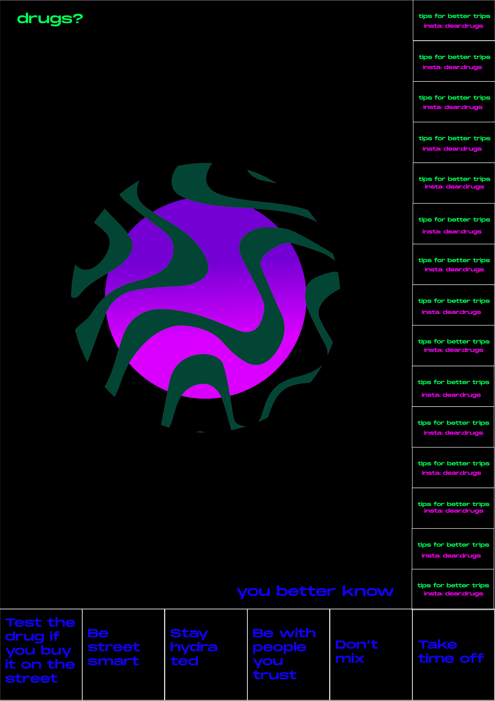

#Drugs

It’s no secret that drugs are commonly consumed at music festivals, dance clubs or raves.
Quite simply, people do it because it can enhance their experience. But we’re not here to justify, give reasons or explain why people do it.  It’s a fact.
Drug use exists, and there’s the urgent need to make it happen in the most safe way possible.
We take for granted that festival organisers know that drugs will get onto the site, so we believe it's a responsibility to make sure people remain safe. Denying the issue just causes fatalities.

“Festivals attract a wide array of people not experienced with party drugs. Relying on strangers inside to purchase drugs is a risk factor for purchasing adulterated products. Fear of security/police at festivals leads to risky drug-taking such as ingesting one’s full batch of drugs at the entrance. These risks are compounded by environmental factors including crowding, hot temperature, and lack of water and inadequate medical emergency response.”

We want to help people to make informed and responsible choices, raising awareness about substances in circulation and reducing the chance of drug-related problems.

We hope for a local music policy that doesn’t deny the use of drugs but aims for harm reduction advice and support by showing how to do it safely, giving a non-judgmental service, accessible and available to all.

We are working on informational outputs, some developed as a guerrilla marketing action so to print out posters and to stick them around clubs, bars and discos. Also, connecting stickers to a survey to gather data and to a insta account. We want to create a community.

Mari and I are working on this project together and decided to submit a project for a Sonar open call that gives space to the development of AR/VR design projects!!! Due to feb 26th.

REDUCE THE HARMS
If you use, better to:

Be street smart
Test the drug
Be informed about the correct amount of quantity related to your gender and weight
Limit the number of drug per session
Limit the quantity
Limit how often you do it
Stay hydrated
Tell at least one person that you’re taking drugs
Be in a safe environment, surrounded by people you trust
Don’t be afraid to get medical help if you need it

**Developments**

I'm mainly focusing on the project **DRUGS? YOU BETTER KNOW**
Using AR, VR, and interaction design our project aims to generate a non judgmental and open minded environment to dialogue and get information about drug consumption in an informal, immersive, inclusive and interactive way.
It’s no secret that drugs are commonly consumed at music festivals, dance clubs or raves.
 we don’t want to justify, give reasons or explain why people do it, we just take it as a fact. There are a number of different reasons why people choose to partake in altered mind states when attending such events. Our goal here is to increase the pragmatic conversation pertaining to the recreational use of drugs through interaction design, developing interactive tools to inform as well as gather data on how much do people really know about drugs.

In a nutshell, We want to help people to make informed and responsible decisions, implement a dialogue and conversation about the topic, raise awareness about substances in circulation and reduce the chance of drug-related problems by offering an immersive, visual and fun experience throughout AR, VR and interaction design accessible to all, also to people who do not use drugs.

**The infofree warehouse** VR immersive experience.
Here you are, you enter a warehouse dancing it out. The environment is a bit dark and there’s people around you. You spot some icons that stand out in the crowd and driven by curiosity, you decide to touch them.
Our VR immersive experience seeks to simulate what happens in our minds, literally, when consuming drugs at recreational spaces. The user is then placed into a warehouse club environment, with figures dancing. Mixed within the dances, you can see brightly coloured interactive icons. These icons represent different drugs made available in the surroundings. Once you approach the icon, a trump card is pulled, with the name and information for the selected icon. Once you are informed, you are then able to select if you want to consume the substance, or not. If you choose, not to, you will remain in the current environment. If you do chose to take the substance, you are then moved into a different environment representing your “trip”. While we think the concept of cyberdelics is very interesting, we also understand that the stigma for taking drugs is not entirely audio-visual. Thus, rather than imitating a trip, we decided to make the environment inspired by the biological effect of the drug. “The binding of drugs with proteins in the blood stream is an important process in determining the eventual activity and fate of such drugs once they have entered the circulation.” For our environments, we then developed models for the determined proteins that encapsulate each individual drug. The idea is that people also become informed of how the drug interacts with our bodies literally, judgement-fee. The initial catalysis.

**The conversation wall** Interaction design and AR.
The lack of communication and dialogue about drugs brings a huge lack of awareness and information in the topic itself. Also, sharing personal experiences can prevent harm to other people. We wanna help people to communicate their opinion and experiences about drugs in a way that can allow them to feel comfortable in sharing personal opinions and experiences.
We designed an interactive board, which has printed 23 statements about substance use or non-use and 9 icons. Under each sentence and icon there's a long pin. At the beginning of the board there's a simple question: "Do you do drugs?" and the journey begins by answering this question by choosing magenta loops as a "yes I do" and blue as a "no I don't". Users can put as many loops as they want. To allow people to feel more comfortable with their own answers we came up with the idea of the invisible answers. The icons, when scanned, show more deep and intimate statements. Using an augmented reality development package and ARKit, we developed an app which allows users to individually scan each icon, and in return, the app displays the "invisible answers” on the user's phone. This is to allow people to feel more comfortable and less judged in sharing. The app however, is limited to individual deployment, thus we have to deploy it on each IOS device by building it through XCode. Having said that, the code is currently limited to IOS builds.
Depending on the environment that will be available, we will adapt the board: phrases and icons can be either printed on a plywood panel or printed as stickers and attached directly to the wall. Depending on these options, we will understand the resistance of the installation and decide what material to make the magenta and blue loops of. Can be 3D printed in plastic or made out of fabric.

**FIRST INTERVENTION**

As a first intervention we decided to listen to the voice of Barcelona people. We wanted to be down to earth and just see how people reacted to the simple question of asking them to share their experiences about drugs.
We came up with a simple but effective concept: a captivating and appealing sticker to put in target areas, like bathrooms of clubs, bars etc... with a simple question and a QR code that leads to a Google Form where people can anonymously write about some experiences that happened under the effect of drugs.

We received many stories, it was very satisfying realising that people are open to share.

**Developments**

The project is changing and evolving each week. Now it even changed name and became **BEYOND DRUGS**.

Beyond Drugs offers a captivating virtual reality experience that intersects multiple concepts, such as protein unfolding and Huxley's Doors of Perception, to shed light on the often taboo conversations surrounding recreational drug use. The project aims to provide an inclusive and immersive experience to bring attention to the hidden dialogue around drug use.

Drug consumption at music festivals, dance clubs, and raves is a well-known fact, and the project does not intend to justify it. Instead, Beyond Drugs focuses on creating a non-judgmental and open-minded environment that encourages pragmatic conversation around recreational drug use. To achieve this, the project uses interactive design and tools to gather data and inform users of personal experiences related to drug use. Increased dialogue can help reduce stigma and discrimination and acknowledging drug use can help mitigate harm. Beyond Drugs believes that promoting a more accepting and open attitude towards drug use can make a significant difference.

The project is a continuous series of interactive experiences that coexist to enlighten a non-biased dialogue referring to recreational substances. What we would like to present for this Open Call is a virtual reality environment which serves as the complementary piece to a previously performed interactive installation: “the confessionary”. Final exhibition presented in virtual reality is then a piece compiled from audio data previously gathered through the confessionary, working as follows:

- confessionary: audio recording
- audio2face conversation: NVIDIA Omniverse AI used to animate face models with pre recorded audio
- VR experience: animated anonymous faces tell individual and personal stories

The lack of communication and dialogue around drugs often leads to a lack of awareness and information about the topic. At Beyond Drugs, we believe that sharing personal experiences can be a valuable tool in preventing harm to other users. To promote communication and comfortability, we have created The Confessionary - a personal, protected space where users can freely narrate their personal experiences with drugs anonymously. The Confessional is made of plywood, lightweight, and easy to carry around.

All the stories shared in The Confessional are then translated into our VR experience. We recognize that the use of substances is both literary and personal, where one's experience is only superficially narrated by literature on a substance and its effects. Therefore, we believe that personal conversations are essential when discussing the topic of drugs. When someone wants to try a new recreational substance, one of the first things they often seek is information on the effects and experiences of others. This information is usually found online or from friends. However, we want to provide a safe space for people to share their experiences and create a database of stories which will be exhibited in following installations. We believe in the power of storytelling. Through the power of personal narratives, we hope to promote understanding, reduce stigma and discrimination, and create a more accepting and open attitude towards drug use.

A space to share. VR immersive experience.

As users enter the virtual reality space, they are presented with a room filled with many doors. Each door represents the entrance to a different recreational drug, offering users a range of choices. Upon entering a particular door, users are transported to a room filled with faces that speak about their experiences with the drug. These conversations allow users to explore the positive and negative effects of the drug from the perspective of those who have tried it.

But Beyond Drugs goes beyond mere dialogue. The room also includes the protein structures that receive the drug in our bodies. Users can see the unfolding of these proteins and gain an understanding of how the drug interacts with their body at a molecular level. This experience provides a deeper understanding of the effects of the drug on the body and mind.

The concept of Huxley's Doors of Perception is also at play in Beyond Drugs. By presenting users with the opportunity to experience different recreational drugs in a safe and controlled virtual environment, the project challenges their preconceived notions of reality and expands their understanding of the world around them. Users are forced to confront the consequences of their actions and explore the consequences of their choices.

In conclusion, Beyond Drugs is a thought-provoking project that combines multiple concepts to bring to shore the hidden conversations around recreational drugs. By using virtual reality to present users with a safe and controlled environment to explore the effects of different drugs, the project challenges their preconceptions and expands their understanding of the world around them. Through the immersive experience, users gain a deeper appreciation of the unfolding of proteins, the Doors of Perception, and the impact of their choices on their mind and body.

**Developments**
