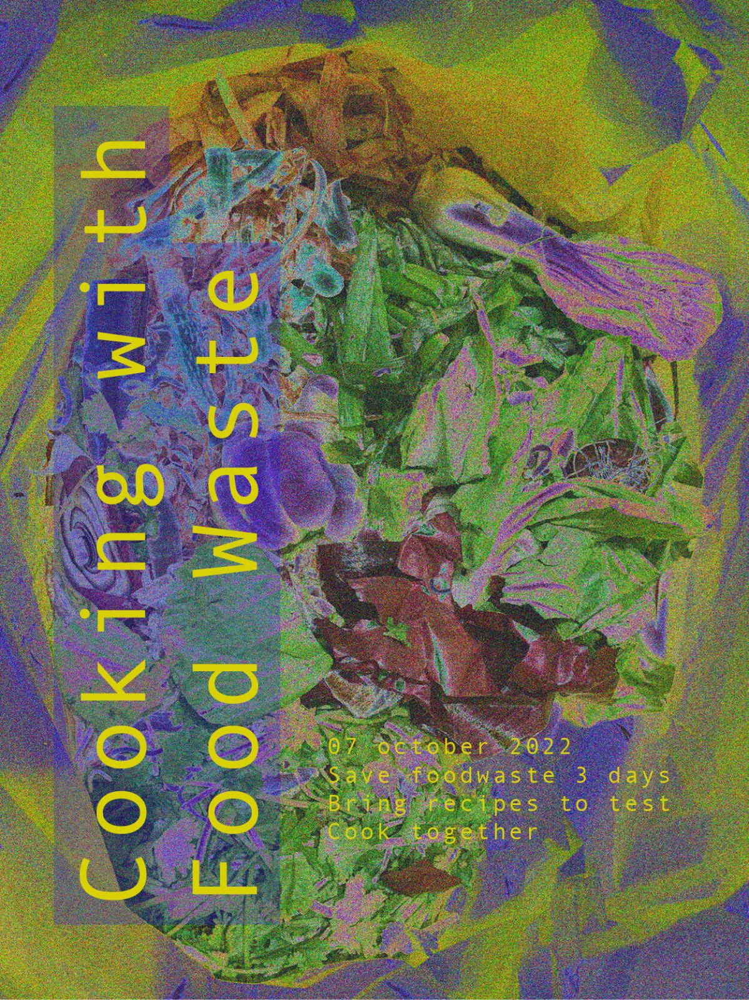

#An intervention
**Waste cookers: Sami, Ramiro, Josephine, June, Marc, Claudia**

Are we aware of how much food we waste?
Are we aware of how much we throw away while we cook?

No, and no.

In order to understand better, we decided to put ourself in first perceptive and analyze our limits and our skills.
We collected food waste (parts of vegetables that we would have thrown away while cooking, bad gone food etc...) for a couple of days and on a Monday night we met.
The table of my kitchen was covered in food waste.

**First step: analyze what we have and come up with recipes to cook**

*INGREDIENTS*

old and dry bread (a lot)

olive water

pumpkin skin

pumpkin seeds

lemon

cucumber peel

avocado peel

old carrots

carrots green

beetroots green

old lettuce

old apples

mandarine peel

old lemons

apple peel and core

carrots peel

potatoes peel

olives water

asparagus white part

agua faba (from chickpeas)

old tomatoes

coffe grounds

sweet potatoes peel

old wine

old yogurt

In order to realize some specific recipes, we used also flour, sugar, salt, olive oil, seed oil, philadelphia cheese, cinnamon, tahin, curcuma, pepper, almonds.

*RECIPES*

• **Pumpkin skin cream**: boil the pumpkin peel with salt until in gets soft, then blend it and adjust the flavor with pepper, lemon and curcuma.

• **Agua faba crackers**: whip 100g the aqua faba and then add 100g of flour and 40g of olive oil. Bake in the oven at 180 degrees for 24 minutes.

• **Beetroots greens**: boil the greens and blend them with tahin, olive oil, salt and pepper to make a cream.

• **Carrot green pesto**: mix the carrot green with almonds, philadelphia and olive oil and blend!

• **Sweet potatoes, carrot and potatoes peels chips**: mix all the peals and add any kind of spices that you feel like and oil. Side it with aquafaba and cucumber peel dip.

•**Apple crisp**: cook down apples with sugar and cinnamon, until soft. For the crisp, make bread crumbs and combine with spices, sugar, cinnamon and butter. Bake the apples first for 20 minutes, and then after add the crisp mixture onto of apples and bake for 20 min.

•**Carnaval toast**: Heat milk and cinnamon in a saucepan and once boiled, add sugar. You cover the bread with the milk. Let stand for 1h. Then you roll the toast with egg and fry it with plenty of oil.

•**Mulled wine**: cook the old wine with mandarine peels, sugar, cinnamon, apple peals and cores.

*REVIVING RECIPIES*

• Stale bread, soak in water and bake it for 15-20min at 148 degrees
• Lettuce: soak in cold water for 30 min

**Second step: hands in action, let's cook**
Each one of us focused on some specific recipes, we helped each other along the whole process. We were tasting and having other people testing food all the time trying to make our best in order to actually have something nice to eat.
We really exchanged knowledge and skills all the way through, listening to each other and respecting each other.

Honestly, it was great.

It took us around two hours, we had many steps to do and just one kitchen with basic tools available.

**Third step: set the table, sit down, taste it out!**
We decided to make it nice, we felt like we deserved it. So we cleaned everything and set a nice table, even with candles!
We recorded the testing moments because we wanted to remember real reactions.
We didn't expect it at all but we can say that the food was good, and it was so much! We all went back home with full stomach and full tupperware with some leftovers!

**Fourth step: reflections**

We decided to reflect before and after the experience. These are mine.

Reflection from Food Waste Dinner

*Before*

What are my expectations about cooking with food waste?

- First of all, I hope we have enough waste to cook. I'm a little scared, I don't know what are we actually gonna be able to cook because cooking in general is not easy, and making something taste good takes a little bit of practice, especially if it's food waste. Joining forces can help, I'm sure, and I truly believe in the team. I hope we manage to respect the space and the tools that we have available.

Why do I think of this as food waste? / why would I normally be throwing it away?
- I truly believe that the food waste that we generate has a huge cultural components: we are just not used and not educated to cook some specific parts of fruits and vegetables. Another problem is capitalism: I know I'm sorry to bring it up as the devil always but we are so used to have fast and demanding life so that we have very little time and we end up going groceries maybe once a week, well I think that this system generates more waist, compared to the utopian idea to be able to each day, or every other day, buy what we need to eat, consume it and not forget it in the fridge.

*After*

How was the experience? What surprised you?

- What surprised me the most was the amount of food waste that we collected, and the fact that after cooking we reduced it just to a small bag of waste. From a table, to a bag.
I really enjoyed the flow of ideas in the cooking process, and the support that we gave each other while cooking.
Also, I learned new recipes from other people. Which is great.
We shared a beautiful evening and dinner, It was nice to make new connection with people that I don't spend that much of a time with in class.

#Intervention development

The first person perceptive and the waste cooking experiments kept growing on me, reason why I decided to explore more about food waste in Raval. I found out about **FoodNotBombsBCN**, a collective that gathers food from supermarkets that would toss it away and then cook it for people in need. Specifically, they cook for Raval community every monday in a place called Agorà, a community area open to anybody.
On Monday the 28th me and other mdefers who are developing projects related to food waste and material waste decided to join them, to see how they work and how does the community react.
We met at 5, saw what they collected from a supermarket and improvised a recipe: we cooked an amazing vegan paella.
We showed up without any claims, just observing and collaborating in order to understand better and then make our own ideas and opinions.
About the community who showed up to eat, some of them were friendly, wanted to talk and communicate, some other were just not. I think it takes time to build trust, to manage to gain confidence.

**Design challenges and opportunity:**
We will go again and we decided to collaborate with them. We observed that the leftover food that they cooked get delivered to homeless people in the neighborhood in not recyclable doggy bags. That's why we decided to develop a DIY doggy bag with eco and bio materials. This is also gonna solve another problem they're facing: while they cook, many people from Raval are just sitting down, waiting, or minding their own business in Agorà. There is not much of cooperation and participation. One of the main goals of FoodNotBombsBCN is also to create a strong and supportive community, so we thought that a nice way to engage the people with each other and with the organization would be to give them something to do together, that creates closeness and dialogue. Something like building the box where you can bring home the food if you have some leftover or if you're not hungry at the moment.

Check our experience **[here](https://vimeo.com/776626749)**
