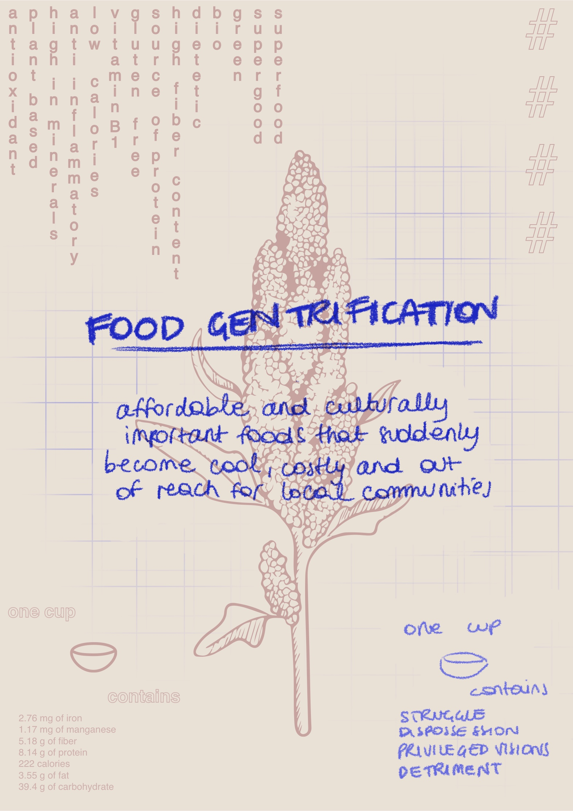

---
hide:
    - toc
---

# My fight

Food Gentrification happens when an affordable and staple ingredient suddenly becomes, in another side of the world, very cool, trendy, costly and then out of reach for poorer communities that depended on that specific ingredient or food. This causes a dispossession of culturally important foods to traditional users.
Generally speaking, usually this happens when the white middle and upper classes are immersed in alternative food networks and so they impose privileged visions of food access, causing a detriment to minorities and lower income classes.

In the last ten years North America and Europe have been overwhelmed by a “green wave”, that caused a big and positive change in many fields, bringing people to a new awareness and concern about sustainability. This trend of sustainability helps spreading its values, but has also many downsides (greenwashing is probably the biggest example).
The “green wave” has brought many positive outcomes in the we approach to food and in the way we eat. It is more easy and common to find vegetarian and vegan options in restaurant for instance, or we are all more aware how much water and supplies do meat industries need and how they actually treat animals. But probably we’re not so aware about the negative consequences of this huge and sudden change in the way we approach to food.
Just to be clear, I’m not against it, I just would love that everyone trusted the market a little less, because the greenwashing happens everywhere and in any possible way, and nowadays for many producers this sustainable approach is not an ethic but just a way to make money.
The most common example of a trendy green food that has huge social consequences is avocado, that nowadays can be also called the “green gold” and that causes many conflicts in South America, but we keep having our avocados on toast thinking to be very healthy, green and bio (just a very small number of people know the actual meaning of “bio” and they use it as a label for everything).

I decided to bring quinoa as a case study, after traveling around Perù for more than a month, hiking a lot and being in deep contact with small and local communities, so after having the chance of eye-witnessing how much traditional users actually depend on quinoa. They have it almost for every meal, mostly cooked in a soup.
Quinoa from being a local food, integral to indigenous people from Andes, suddenly became a burgeoning global food commodity, a statement to say “look, I eat healthy and respect my body”.
Local users cook it very differently from the way we do in Europe, so beside the dispossession there is also traditional misreading and disrespect.
The global prices for the crop are rising and becoming unaffordable for traditional users, and as in most of the industrialized processes rural communities are always the most vulnerable participants, so even if they own the food, they get least benefits from it.

My personal fight is to become more aware in the way I eat, try to be more critic and analyze deeply what is sold by industries, try to go deeper and understand the world in a wider scale, not just stopping to my personal interests and comforts. I wanna be fully conscious of the social and environmental consequences of my actions.
In my opinion, being more local as possible, when it is possible, is a very good way to fight extreme globalized and gentrified food. We have to learn more where food comes from, what consequences does it have, and also acquire a knowledge about what does the ground where we live can provide to us. We should count on proximity life, buy in local shops and small scale producers, also to support them.

My fight starts with me, I wanna educate myself in order to involve and generate interest, and, hopefully, a change.

