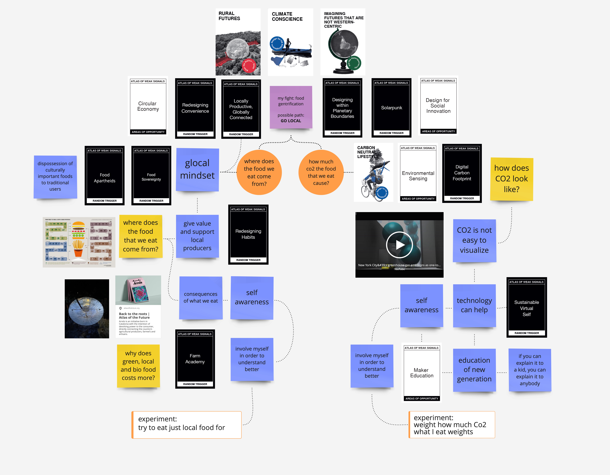

---
hide:
    - toc
---

# Atlas of Weak Signals

Atlas of weak signals seminar: at the beginning of the week I had no idea what these days would have brought me.  
During this week I started to navigate topics and areas of opportunity of design that I am interested to. Thanks to the card game and to the dialogue with other people, we explored every possible emerging scenario of any possible emerging future. Or at least this is how it felt to me.

But what is a weak signal? It is an emerging trend or topic that has a potential to become huge. And it can speculate any possible future.

We were asked to explore the cards, pick some random ones and then choosing them. Also, we were asked to pick a favourite one: very hard task in my opinion. It feels impossible to me choosing one field. If I really have to chose one, that I would go in the field of Design for anthropocene and choose Climate Conscience. But also Locally Productive Globally Connected truly represents me and my interests, as Design for Social Innovation, Redesigning Habits, Circular Economy or Digital Carbon Footprint.

Okay, yes. I'm interested in many topic.

We started building our design space, usign the cards, some case studies and our free reasoning. My design space went through many developments and changes. From "how does what we eat affect the world" to "how to visualize Co2" and then "clay and local materials".
Eventually, what I understood was the connection in between all of these design spaces, is the concept of LOCAL. Eat local, speak local, buy local, learn local. Respect local. Be local. Connect local.
From the clay that you use to do pottery to the vegetables that you cook for dinner.

Why?

To fight ecological crises, to support local producers, to reduce Co2 emissions. To be more in touch with what our land can offer us.

