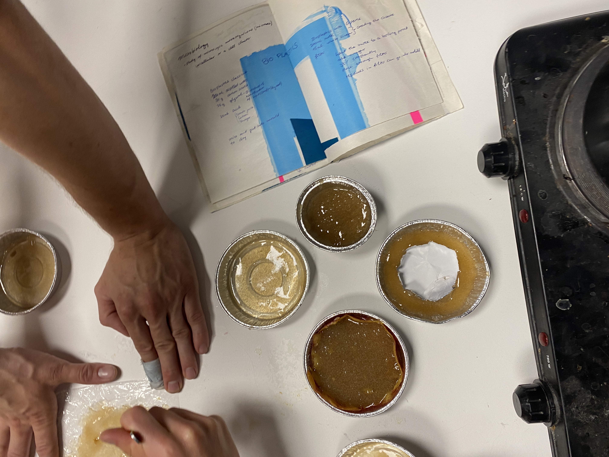

---
hide:
    - toc
---

# Bio & Agri Zero

A picture that represents my journey with Nuria and Jordi through Bio and Agri Zero weeks.
That day we were making bio plastic (which are not the solution okay?) but after some hours of listening to bio plastic theory, using our hands, brains and recipes to actually make some felt incredible.

During the two weeks, it felt good to learn science and chemistry in an active and creative way.

#Honey bees get stressed
**Why honey bees get stressed? And what are the consequences?**

**Stress**: noun

// A state of mental or emotional strain or tension resulting from adverse or demanding circumstance.
// Great worry caused by a difficult situation, or something that causes this condition.
// Physiological concept that allows organisms to respond to adverse environmental pressures.

And yes, not just humans and other mammals can feel stressed, but also honey bees.

The articles that I want to discuss claims that **[Bees get stressed at work too and it might be causing colony collapse](https://theconversation.com/bees-get-stressed-at-work-too-and-it-might-be-causing-colony-collapse-96412)**, (published in June 2018 by The Conversation).

That animals feel emotions and moods we can take for granted: emotions is not just an internal awareness of a feeling, but also a physical and behavior change.

The emotional life of animals, insects and specifically bees has been studied for a long time, and it showed impressive results: bees don't experience human-like emotions, but it feels like something to be an insect.

Some recent studies by Geraldine Wright at Newcastle University in the UK have showed that honeybees may experience something akin to moods. They proved that bees show a state of negative affect triggered by agitation, *"associated with system-wide changes in neurotransmitters and causes clear, measurable cognitive biases"*.

**But what does cause stress to honey bees?**

Stress in bees has been studied throughout the reaction of multiple aspects as behavioral, physiological or cellular stress responses. And, as it happens to human, stressors affect the immune system, causing ripple effect. Here are some causes of stress in honey bees.

The shape of the hive can be a cause: Open Source Beehives designed a hive that encourages happiness for health bees, by reducing the stress. The shape of common hives aim to maximize the honey production. This one instead allow bees to build their combs in more natural curving shapes.

Also, when a parasite infect the hive, they produce a warning **pheromone** to communicate the danger to each other, and this pheromone itself cause a social stress. But if the threat is bigger than a parasite, let's say a big animal, or a human, the bees are gonna produce a bigger quantity of pheromone.
Yes, bees are social insects and as most of them they use pheromone to communicate! Insects have been using pheromones for communications throughout evolutionary history. Chemical communication help insects to be organized inside the colonies.

*“If the social harmony gets disrupted, it can cause colony collapse, meaning complete dysfunction of the hive.”* Christopher Mayack says.

What is this pheromone? Bees release it when they sting, when they're killed, to take care of other individuals, but they use it also to mark flowers after they removed the nectar. It is basically a call to action used for collective decision making and rapid communication in the community. And it can work in a repelling or attracting way.

Another cause of stress is the **intense foraging**. Honey bees develop and change many jobs during their working like: they start brood nursing, cleaning and food storing, then they might get a promotion to be a guardian of the hive entrance against intruders and predators.
But the major event is when they have to work in foraging for food sources. This big jump to foraging corresponds to hormonal and physiology changes, and that’s because foraging requires a lot: it is the activity that exposes bees to most stressful situation, that requires the biggest amount of energies and exposes the insect to new environments.
*”Octopamine is two to four times more abundant in brains of forager than those of nurse bees”*.  
Octopamine is a neurotransmitter that basically works as prompter of dynamic actions to the organism and help honey bees to deal with the stress of foraging.

**And what are the consequences of stressed honey bees?**

Colony collapse disorder (CCD) is the answer.
This syndrome has been affecting honey bees increasingly over the past 15 years and is *"the result of an accumulation of stressors chronically weakening honey bee colonies"*.
This phenomenon happen when the working bees disappear and leave the queen and some nurse bees alone in the hive.
The Colony Collapse Disorder in a very complex syndrome with many causes, but stress is one of them.
The stressors that are causing an increase in honey bee colony failure rates are multiples: diseases, parasites, pesticides and poor nutrition for instance. But we don’t have just direct threats that are causing this issue, but also the so called “sublethal stressors” which don’t directly kill bees, but harm them or make them change behavior. In other words: fumes and pesticides disturb chemical communication in honey bees’s brains.
This means just one thing: empty hives.
Other reasons are related to the CCD as poor nutrition, pathogens, parasites and pests and many actions are being taken into consideration in order to protect honey bees and pollinators (wild bees too are in danger and very important for the environment.) The best thing that the public can take is not to use pesticides randomly and help them out by planting pollinator friendly plants as foxglove, bee balm, red clover and other plants!

**SITOGRAPHY**

https://www.mdpi.com/2075-4450/3/4/1271/htm

https://www.newscientist.com/article/2275857-honeybees-stress-each-other-out-by-warning-about-minor-parasites/

https://www.scientificamerican.com/article/do-bees-have-feelings/

https://www.researchgate.net/publication/262032219_Bees_under_stress_Sublethal_doses_of_a_neonicotinoid_pesticide_and_pathogens_interact_to_elevate_honey_bee_mortality_across_the_life_cycle

https://www.imperial.ac.uk/news/239174/museum-collections-indicate-bees-increasingly-stressed/

https://royalsocietypublishing.org/doi/10.1098/rsos.210194
