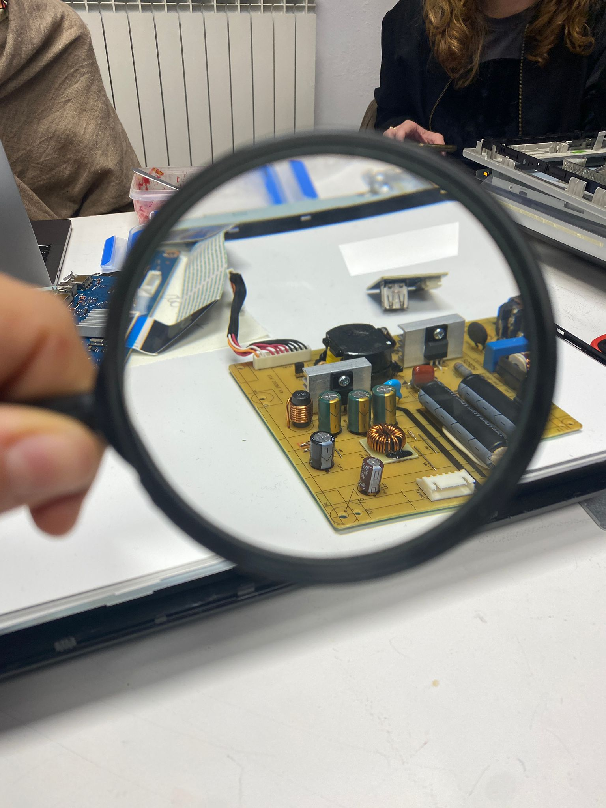
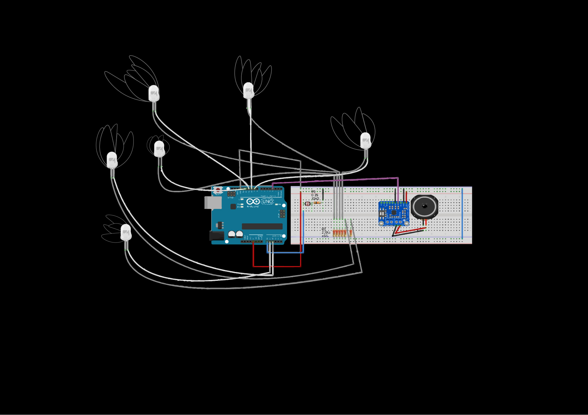
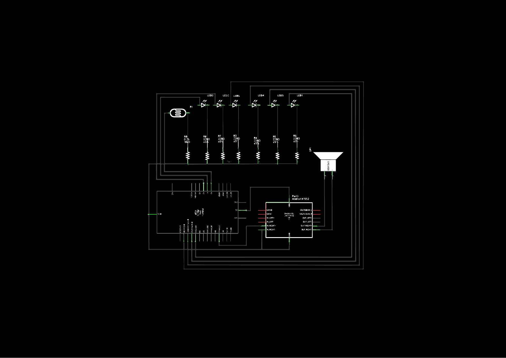

---
hide:
    - toc
---

# Tech Beyond The Myth

Laptop screens: let's dig in.

What did we find that surprised us and that we wanna explore and work with:

- green and orange LEDs are used in the monitor to indicate the mode that the monitor is in.

- one push-button of a button-board (of total eight buttons) that we extracted from a Philips-monitor

- two small speakers extracted from the front facade of a Philips monitor that were places right below the LCD-screen.

- screen plastic layers

**Ghost Sensing Machine**

We started with materials from two laptop screens:
We had screen layers that fascinated us a lot and then we started experimenting with speakers and LED in order to understand Arduino. This is how we started.

We made order and understood the faction, in order to later be creative and twist the functions!

That’s why we decided that the LED, instead of being a light output, would have become a light input, basically sensors.

While developing the process, we explored different possibilities

*Emotion communicator*:
The LED-lights work as a light-sensitive sensor. Hiding them from light will show a different color than exposing them to light. In this way you can have the machine in your hand, and according to the way you feel (anxious=no contact=show light=put hand over LED) the machine will communicate your availability to the outside world.

*Small talk avoider*:
Each button has a programmed answer in the form of sound/ noise.
Instead of having small talk, you can choose a button and let the machine communicate for you.

*Ghost sensing machine*:
Takes inputs from LED as sensors and turns them into sounds and light.

The Ghost Sensing Machine captures ghosts and produces sounds when senses that a presence is being around…
The light sensors pick up light and electromagnetic noises around the environment and translates them into sounds.

Creepy enough?

Basically it won’t help you, cause it’s not supposed to, but it’ll scare the shit out of you even more by saying:
“Hey, there’s a ghost around! Goodbye.”

**Material used**:

- Arduino Uno
- 6 x white LEDs
- 6 x 220 ohm resistors
- 1 x LDR sensor
- 1 x 10k ohm resistor
- Recycled speakers from monitor
- PAM8403 3w class D audio amplifier
- Recycled screen plastic layers from monitor

**Coding logic**:

The code reads the analog input from the LDR sensor determines if the amount of light changes. If the ambient light sensed is below the threshold it will turn off the lights and make the sounds from the “ghost” passing over.

See the result **[here](https://drive.google.com/drive/u/0/folders/1g18QFqPTuV1m8AqqSX-L0J4P4Ye0iY3x)**
