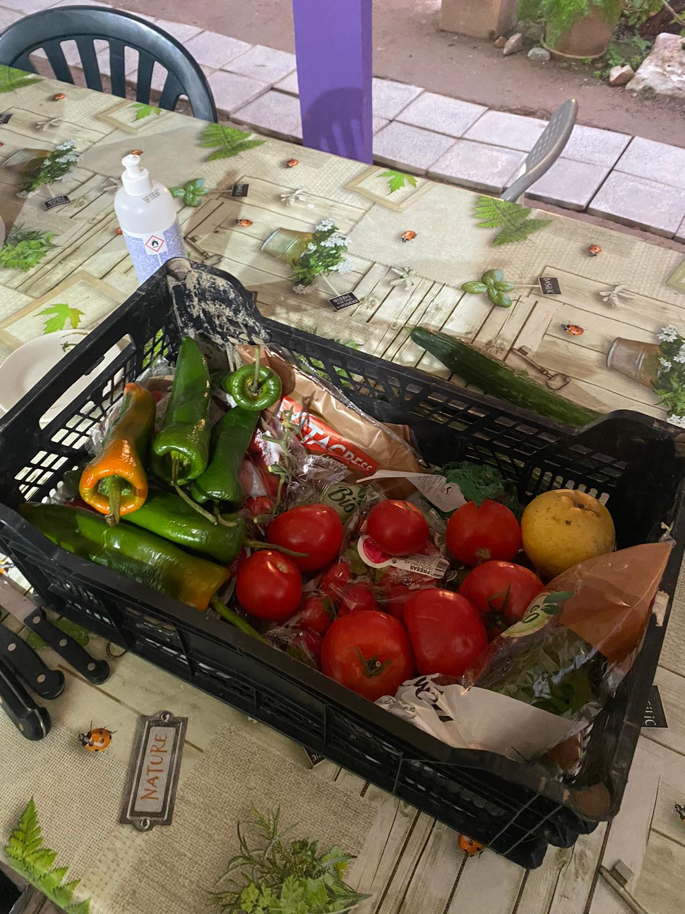

---
hide:
    - toc
---

# Community Engagement

Classes happened in Can Batllò, un espacio comunitario in Sants, with Markel Commen and Mercè Rua from Holon.

*"Simplifying complexity is never a good idea"*, every challenge assessed with sufficient perspective becomes a wicked one. We know how to deal with the simple and complicated but not with the complex ones.

**Transition Design** is a social and environmental context of design, it shapes the everyday life of transitions and seeks for long term transitions with a proper theory of change in a long term vision of impact. Within the mapping process, it helps to relate with communities and to approach a post humanist perspective.
But how to intervene in a system?

- sense and understand system dynamic

- identify pressure and leverage points

- build more desirable future visions

- crafting an intervention portfolio to plot who else is in the system

- probe, sense, respond: waiting for the system to react

- practice the back casting: starting with the future vision and go background to the present in a transition pathway

*"The value of design is in its process, not just the output"* cause the process itself has an impact. Design requires a commitment to a purpose of practice, brings whatever knowledge and capabilities to address a problem or an opportunity.
When designing community engagements the role of the **facilitator** make the process easier: we're always operating in a complex system so we need this role who provides infrastructures, process and support necessities to perform a task, but staying out it. The facilitator does not participate but creates and inclusive space to encourage full participation and effective communication. Dance and balance!

When working with communities we must know the concept of **social capital**, the network of relationship among people who live in society, enabling that society to function. It's the capacity to engage in a group by creating relationships and a shared sense of identity.
Why it matters?
Who has it?
How to get it?
We all live within social capitals, have different roles and give different level of importance to each of them. Family is an example of social capital, an university class, or a political party.

# Creative Community

**Context:** *“Solitude is fine but you need someone to tell you that”*  Honorè de Balzac.
The context that I decided to explore is the loneliness and solitude developed in the small towns of 5 Terre in Liguria, Italy. During the summer 5 Terre are victims of mass tourism and they get overcrowded and over populated, but as soon as the temperature drops and it becomes cold, they are lived by average 1000 citizens per town, excluded Corniglia that just has 195 citizens.

 **Current situation:** Life in the winter is tough. Most of the population run jobs related to tourism, so they don’t work in the winter. Life is always the same, and with the excuse of “resting” and that the town doesn’t offer much, most of the people just end up in self isolation at home. Everyone knows each other and there are no impulses from the outside world, not many changes to explore and not many reasons to go out, to actually interact with each other. People feel like they already know each other, since that they grew up and lived in small towns, that we can consider like communities. Nothing’s new, nothing to do, nothing to say.

**Engagements and limits:** the first limit is that changing habits is hard. That’s it. The engagements that can work with this kind of limit is to create an impulse, a color, a small change. But it has to arrive from people, for people. Since that we would operate in a small town, I would keep the small approach and think small. Another limit is also the different ages of the people we want to cooperate and work for. The habitants go from kids to grandparents.
Theory of change: try to increase the amount of human encounters with simple tools that everyone can easily access to and integrate to the every day life. A tool that people could use to show approachable and happy to engage in a brief chat, conversation, or share a moment with a cup of tea. A simple sign that I can put outside my door, or I can comfortably wear when I go out, that tells everyone that I’m up for a chat, for a coffee, or for a walk together. We could even develop a language of shape and colors that show different interests. (like green dot to go on a walk, yellow dot to go groceries together etc etc…)

**Design challenges and opportunity:** since that not everyone is comfortable with smart phones and technology, the tool must be physical, tangible, practical. Also, it must speak an open language that everyone can understand, maybe a symbol, like a dot or a square that becomes a mutual meaning for the whole community to read. The biggest opportunity that I can spot is that in community many things happen just by following each other’s examples and positions. If one starts, is a close community, is easy that somebody else is gonna follow creating a positive contamination of habits.

# My experience with a Community

**FoodNotBombsBCN** is a collective that gathers food from supermarkets that would toss it away and then cook it for people in need. In Barcelona FoodNotBombsBCN operates in Agora, un espacio ocupado en el Raval, where they cook for the community every Monday.
Me and other mdefers who are developing projects related to food waste and material waste decided to contact them to join Monday the 28th. We cooked an amazing paella with them with food absolutely fine to eat but not beauty enough to be sold.
We showed up without any claims, just observing and collaborating in order to understand better and then make our own ideas and opinions.
About the community who showed up to eat, some of them were friendly, wanted to talk and communicate, some other were just not. I think it takes time to build trust, to manage to gain confidence.
We will go again.

