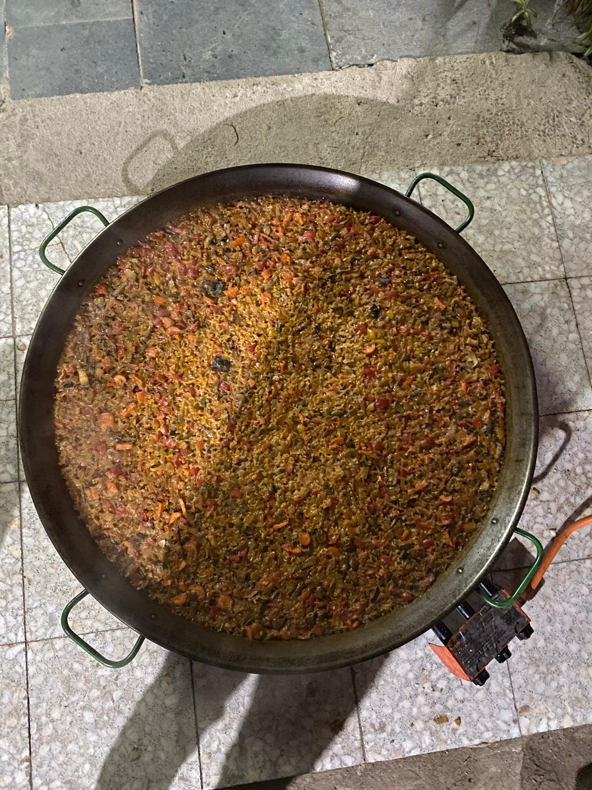

---
hide:
    - toc
---

# Community Engagement

Classes happened in Can Batllò, un espacio comunitario in Sants, with Markel Commen and Mercè Rua from Holon.

*"Simplifying complexity is never a good idea"*, every challenge assessed with sufficient perspective becomes a wicked one. We know how to deal with the simple and complicated but not with the complex ones.

**Transition Design** is a social and environmental context of design, it shapes the everyday life of transitions and seeks for long term transitions with a proper theory of change in a long term vision of impact. Within the mapping process, it helps to relate with communities and to approach a post humanist perspective.
But how to intervene in a system?

- sense and understand system dynamic

- identify pressure and leverage points

- build more desirable future visions

- crafting an intervention portfolio to plot who else is in the system

- probe, sense, respond: waiting for the system to react

- practice the back casting: starting with the future vision and go background to the present in a transition pathway

*"The value of design is in its process, not just the output"* cause the process itself has an impact. Design requires a commitment to a purpose of practice, brings whatever knowledge and capabilities to address a problem or an opportunity.
When designing community engagements the role of the **facilitator** make the process easier: we're always operating in a complex system so we need this role who provides infrastructures, process and support necessities to perform a task, but staying out it. The facilitator does not participate but creates and inclusive space to encourage full participation and effective communication. Dance and balance!

When working with communities we must know the concept of **social capital**, the network of relationship among people who live in society, enabling that society to function. It's the capacity to engage in a group by creating relationships and a shared sense of identity.
Why it matters?
Who has it?
How to get it?
We all live within social capitals, have different roles and give different level of importance to each of them. Family is an example of social capital, an university class, or a political party.

# My experience with a Community

**FoodNotBombsBCN** is a collective that gathers food from supermarkets that would toss it away and then cook it for people in need. In Barcelona FoodNotBombsBCN operates in Agora, un espacio ocupado en el Raval, where they cook for the community every Monday.
Me and other mdefers who are developing projects related to food waste and material waste decided to contact them to join Monday the 28th. We cooked an amazing paella with them with food absolutely fine to eat but not beauty enough to be sold.
We showed up without any claims, just observing and collaborating in order to understand better and then make our own ideas and opinions.
About the community who showed up to eat, some of them were friendly, wanted to talk and communicate, some other were just not. I think it takes time to build trust, to manage to gain confidence.
We will go again. 

