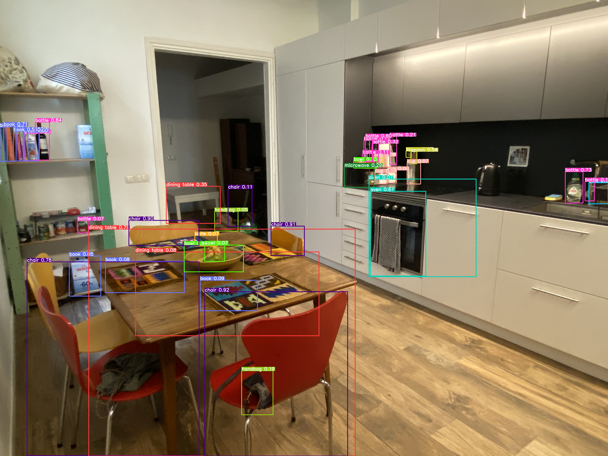
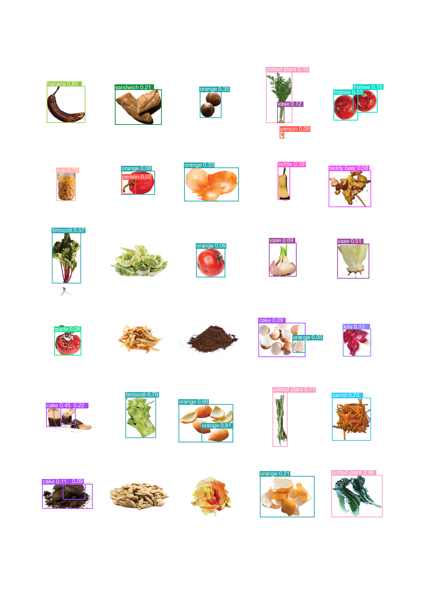

---
hide:
    - toc
---

# Extended Intelligence

**From skepticism to soft obsession**

I knew very little about Artificial Intelligence and I've always been very critical about it. Mostly because I'm scared of the fast evolution of it (and of technology in general)
This is because I feel like there’s a lack of education and ethical exploration in the topic. But anyways.
I’m really glad about this class because it opened a different point of view on the topic, very enjoyable for me. And also the topic of racism in AI started growing on me and I just ordered a book about it.

I really enjoyed the artsy aspect that we had the chance to explore with Taller Estampa and actually when I got back home after class I started trying it out!! I loved it.  

What I found interesting are different aspect of the limits of AI: some funny and some scary ones. Like racism, Eurocentrism and North American centrism which leads to the limit of not recognizing other culture’s habits and stuff. I got very inspired and decided to start a communication project about it. But I learned that negative design is not effective, so I decided to look some ingenuity and sympathy in the AI. My personal project is about the value of waste and its multiple different possibilities, so I started to try it out with food scraps. The results were amazing: the AI doesn’t recognize the waste as waste!

We decided to make posters about it and add it in the aesthetic of our project, but also to show how much waste is subjective, cultural and educational. It's just a point of perception.
