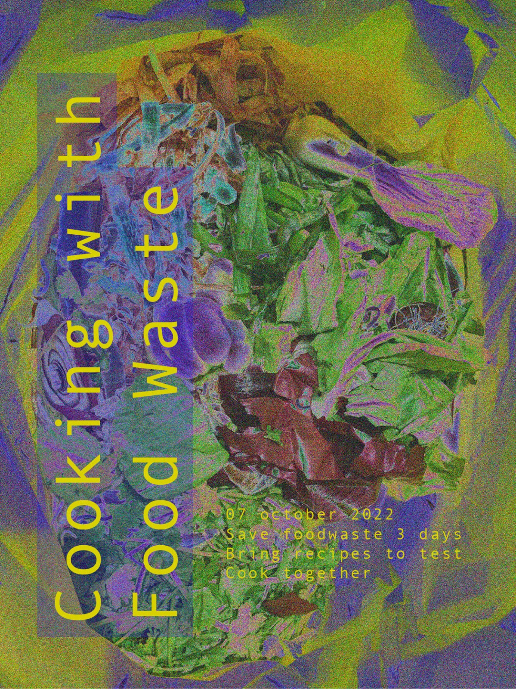

---
hide:
    - toc
---

#Design Studio I

#Personal Development

First week of master, first attempt to understand myself better.
I'm understanding that the process of knowing myself can generate a design action.
Being in control and processing my personal development, the changes I went and I go through and my growth in connection with the environment I live in, can help me to focus on how I see design should be and define my ethic of design.
I wanna put my personal identity in the context of my visions in order to be fully involved.

#Research through Design and Prototype

To generate knowledge, to combine knowledge from different disciplines, to abstract future thinking with everyday practice, to use all the skills that I could have as a designer.

**Role 1.**
The first role of prototyping has an experimental component: the prototype itself embeds what I want to test.

**Role 2.**
Prototype as a tool for inquiry: I don't know what I'm looking for, so prototyping is the way to capture infos and learn by provoking and causing reactions.

**Role 3.**
Research archetype: prototype to show possibilities and physical embodiment of concepts. It helps the designer to understand better the possibilities, it creates possibilities.

**Role 4.**
Vehicle for inquiry: it is not the prototype itself, but the process who generates knowledge. The process as a method and a way to discover, so it should be documented. Getting people involved in the process (co-design, participatory design) to explore together.

During my short experience as a designer, I got in touch with some of these roles of prototyping. I feel that the **Role 1** happened many times when we had to test out any kind of experimental trials like texture, materials or colors. Once, during my bachelor, we had to develop a game made out of recycled materials and after experimenting with a wide range of options we ended up using leftover cardboard pieces to develop a book for children, in order to create different texture.
Another example that comes to my mind is about the **Research archetype**. I worked for a couple of years in a ceramic studio and the studio itself was kind of a showroom. It was full of everyday-use ceramics and people could assembly them choosing any possible way they wanted to. This process became many times an inspiration for us, cause we saw assemblies that we just never thought about and that became new ideas for new projects.
The role of prototyping that attracts me the most, and that I had the chance to explore the most, is the **Vehicle for inquiry**. For my thesis project I decided to do a pilgrimage in the Centre of Italy on a hike called “Cammino nelle Terre Mutate”. 257 km through the villages of Centre of Italy that experienced 2009 and 2016 earthquakes, walking, observing and interacting with local people and environment, in order to find out the necessities and needs of both communities and territory, and try to satisfy them.
The whole project happened just thanks to being involved in first person in the process and to the involvement of the local people that I met on the way and their experience. By exploring together their needs and the needs of the environment, the project shaped itself.

"*A shift from designing for to co-designing with.*" Agger Eriksen 2012.

From this article written by Anna Servalli I found enlightening the concept of *"togetherness that becomes a core aspect of the design process as a way to foster collaboration after the design phase"*

I think that the combination between the second (a role of prototyping that I've never used so it would be self challenging to try out) and the fourth role would be interesting to understand my position and possibilities. I'm interested to understand the **food waste** , **local food accessibility** and **food gentrification** phenomena better, and most of all the possibility to **visualize Co2** emission related to food. I still don't know which way I'm going that's why I believe that see honest reactions along the way could help my development. Also, getting people involved in the project represents a very powerful way of doing design for me, and also an exercise of openness and listening processes.

To start my research, I asked myself 4 questions:

*Where does the food that we eat come from?*

*How does the city of Barcelona manages food waste?*

*How much Co2 does the food that we eat cause?*

*How does Co2 look like?*

I wanna involve myself in the first place. In the following days I'm gonna do 4 experiments.

1. Try to eat just local food for one day
2. What happens if I ask for a doggy bag to bring home my leftovers?
3. Try to see if restaurants, market and shops with local food are easy to spot
4. Weight how much Co2 comes from I eat

#Work Space

#Communication Strategies

**DESIGN FROM GUILT IS NOT EFFECTIVE, we have to create new avenues for exploration, though transformation.**

*Understand my audience*

*Being transparent about my intentions, offering a space where people I'm trying to reach and connect can understand better my background, my values, my commitment, my motives, my positionality – creating a foundation for trust*

*Sharing participants’ observations, reflections and experiences during and after my interventions*

I truly believe in participation in order to make an effective design for people. Coexistence between the designer and its audience, the ability of listening and the willing to change ideas and processes are key points to me.
I'm seeking a open process co-design and participatory design attitude.

#Communication Medium

*A printed newspaper/magazine to reach the local community.*

*Present or do a workshop at a conference.*

*Writing*

*Photographing*

Lately I've been experiencing a strong detachment from social media and digital communication methods. I've been using digital tools in the past with the aim to create strong communities and to reach most people possible. But since I live in Barcelona, I've had the chance to explore another form of strong sense of community life, which is the one that each neighborhood builds sharing local places and doing social activities together. I'm more willing to be physically in touch with people, because I would like to use all of my senses and also I want people to experience a design intervention with all of the five senses.
This doesn't mean that I'm NOT considering whatsoever also a digital output or tool, but I think it won't be my main one.

What do I wanna communicate in my communication strategy?
Show my process, my progress and my intention.

#An intervention
**Waste cookers: Sami, Ramiro, Josephine, June, Marc, Claudia**

Are we aware of how much food we waste?
Are we aware of how much we throw away while we cook?

No, and no.

In order to understand better, we decided to put ourself in first perceptive and analyze our limits and our skills.
We collected food waste (parts of vegetables that we would have thrown away while cooking, bad gone food etc...) for a couple of days and on a Monday night we met.
The table of my kitchen was covered in food waste.

**First step: analyze what we have and come up with recipes to cook**

*INGREDIENTS*

old and dry bread (a lot)

olive water

pumpkin skin

pumpkin seeds

lemon

cucumber peel

avocado peel

old carrots

carrots green

beetroots green

old lettuce

old apples

mandarine peel

old lemons

apple peel and core

carrots peel

potatoes peel

olives water

asparagus white part

agua faba (from chickpeas)

old tomatoes

coffe grounds

sweet potatoes peel

old wine

old yogurt

In order to realize some specific recipes, we used also flour, sugar, salt, olive oil, seed oil, philadelphia cheese, cinnamon, tahin, curcuma, pepper, almonds.

*RECIPES*

• **Pumpkin skin cream**: boil the pumpkin peel with salt until in gets soft, then blend it and adjust the flavor with pepper, lemon and curcuma.

• **Agua faba crackers**: whip 100g the aqua faba and then add 100g of flour and 40g of olive oil. Bake in the oven at 180 degrees for 24 minutes.

• **Beetroots greens**: boil the greens and blend them with tahin, olive oil, salt and pepper to make a cream.

• **Carrot green pesto**: mix the carrot green with almonds, philadelphia and olive oil and blend!

• **Sweet potatoes, carrot and potatoes peels chips**: mix all the peals and add any kind of spices that you feel like and oil. Side it with aquafaba and cucumber peel dip.

•**Apple crisp**: cook down apples with sugar and cinnamon, until soft. For the crisp, make bread crumbs and combine with spices, sugar, cinnamon and butter. Bake the apples first for 20 minutes, and then after add the crisp mixture onto of apples and bake for 20 min.

•**Carnaval toast**: Heat milk and cinnamon in a saucepan and once boiled, add sugar. You cover the bread with the milk. Let stand for 1h. Then you roll the toast with egg and fry it with plenty of oil.

•**Mulled wine**: cook the old wine with mandarine peels, sugar, cinnamon, apple peals and cores.

*REVIVING RECIPIES*

• Stale bread, soak in water and bake it for 15-20min at 148 degrees
• Lettuce: soak in cold water for 30 min

**Second step: hands in action, let's cook**
Each one of us focused on some specific recipes, we helped each other along the whole process. We were tasting and having other people testing food all the time trying to make our best in order to actually have something nice to eat.
We really exchanged knowledge and skills all the way through, listening to each other and respecting each other.

Honestly, it was great.

It took us around two hours, we had many steps to do and just one kitchen with basic tools available.

**Third step: set the table, sit down, taste it out!**
We decided to make it nice, we felt like we deserved it. So we cleaned everything and set a nice table, even with candles!
We recorded the testing moments because we wanted to remember real reactions.
We didn't expect it at all but we can say that the food was good, and it was so much! We all went back home with full stomach and full tupperware with some leftovers!

**Fourth step: reflections**

We decided to reflect before and after the experience. These are mine.

Reflection from Food Waste Dinner

*Before*

What are my expectations about cooking with food waste?

- First of all, I hope we have enough waste to cook. I'm a little scared, I don't know what are we actually gonna be able to cook because cooking in general is not easy, and making something taste good takes a little bit of practice, especially if it's food waste. Joining forces can help, I'm sure, and I truly believe in the team. I hope we manage to respect the space and the tools that we have available.

Why do I think of this as food waste? / why would I normally be throwing it away?
- I truly believe that the food waste that we generate has a huge cultural components: we are just not used and not educated to cook some specific parts of fruits and vegetables. Another problem is capitalism: I know I'm sorry to bring it up as the devil always but we are so used to have fast and demanding life so that we have very little time and we end up going groceries maybe once a week, well I think that this system generates more waist, compared to the utopian idea to be able to each day, or every other day, buy what we need to eat, consume it and not forget it in the fridge.

*After*

How was the experience? What surprised you?

- What surprised me the most was the amount of food waste that we collected, and the fact that after cooking we reduced it just to a small bag of waste. From a table, to a bag.
I really enjoyed the flow of ideas in the cooking process, and the support that we gave each other while cooking.
Also, I learned new recipes from other people. Which is great.
We shared a beautiful evening and dinner, It was nice to make new connection with people that I don't spend that much of a time with in class.

**Conclusions**

Food tasted better than it looked before and made a colorful meal.

The produce was perfectly fine to still consume.

Able to make a good amount of food with the waste food.

Waste food led to creative cooking and a more immersive experience.

Cooking with food waste is friendly on the pocket.

Total amount of waste generated was reduced.

Learned new ways to use all parts of vegetables.

Cooking and eating together are great ways to bring up complicated topics.

#The topic

How the waste stream started?

It first happened in society when the progress of agriculture and farming gave the possibilities to developing countries to overcome the issue of limited food availability.
This technology progress summed up with the increase of the average income of society allowed a bigger part of the population to access to bigger quantities of food.
Food was more available, and it slowly started to cost less. This process caused  a huge damage in people’s perception of food value. When things become more available and cheaper, we automatically start thinking that they value less.

After the Second World War, the city started being overcrowded and requiring more necessities. Transportation and infrastructures solved the problem of the distance between production site and consumption.

Food waste started with globalization, technology and retail distribution.

**Some questions**

What do we want people to perceive?

Do we wanna work on / change perception of value?

Using the senses to intensify understanding / experience

**What is waste?**

waste noun (UNWANTED MATTER):
unwanted matter or material of any type, especially what is left after useful substances or parts have been removed

waste noun (BAD USE):
an unnecessary or wrong use of money, substances, time, energy, abilities, etc.:

waste verb [T] (USE BADLY):
to use too much of something or use something badly when there is a limited amount of it

‘Waste are unwanted or unusable materials. Waste is any substance which is discarded,after primary use, or is worthless, defective and of no use. A by-product by contrast is a joint
product of relatively minor economic value.

#Intervention development

The first person perceptive and the waste cooking experiments kept growing on me, reason why I decided to explore more about food waste in Raval. I found out about **FoodNotBombsBCN**, a collective that operates in Raval, Barcelona.
Every Monday they pick up vegetables and food at Veritas, a bio supermarket in El Born, that would otherwise be thrown away. The other days other NGOs pick up the food waste.
There were 5 people volunteering for FnB when we were there, they go to Agora Communal Garden and cook food with the vegetables they’ve picked up that they then serve for free.
The people that were in the community garden were mostly people that live in the neighborhood and use the garden regularly. FnB wants to serve food to homeless, but food is not a very big problem for homeless in Barcelona, its mostly shelter and care, and they will accept the food if its given to them but they don’t come to the community garden.
On Monday the 28th we showed up without any claims, just observing and collaborating in order to understand better and then make our own ideas and opinions. About the community who showed up to eat, some of them were friendly, wanted to talk and communicate, some other were just not. I think it takes time to build trust, to manage to gain confidence.

While we were cooking, many people from Raval were just sitting down, waiting, or minding their own business in Agorà. There is not much of cooperation and participation. One of the main goals of FoodNotBombs is also to create a strong and supportive community, so we thought that a nice way to engage the people with each other and with the organization would be to give them something to do together, that creates closeness and dialogue.

**Design challenges and opportunity:**
We will go again and we decided to collaborate with them. We observed that the leftover food that they cooked get delivered to homeless people in the neighborhood in not recyclable doggy bags. Also, they expressed the desire to try to connect with other organization in order to wide their web of contacts and opportunities.
Are there other shops that we can connect FNB with? Or other shops that are not giving food away, that we can connect with other organizations so that all shops give away the food?
Can we help to develop these connections?

Can we bond with the people that show up?

Can we create a sense of community?

Check our experience **[here](https://vimeo.com/776626749)**

**Conclusions**

Explore other ways of using food waste.

They have issues with takeaway products to deliver food to people in need outside of Agora.

Material creation for possible use of packaging.

Increase the ‘value’ of food and its journey beyond the kitchen.

How can the community be involved  in the process to close the loop?

Can we connect FoodnotBombs with other organizations/ people to collaborate and help more people in a larger span of locations?

#Third Intervention

**El Doble event**

Bring difficult topic at the table is never easy. We looked for a delicate but effective way to do that and it happened thanks to the collaborations with El Doble, a tiny tapas restaurant in El Born. We knew the chef of the restaurants and at first we were just asking him to collect the food waste so we could use it for our personal tasks. He started being interested in our project and we decided to make an event: a tapas dinner at the restaurant, where people could order ordinary food from the menu and get some tasting of food cooked with scraps. The chef explained all the recipes, how he reused the unwanted item.
There was a part of the room dedicated to posters where people could read, reply and interact with our questions.

**Conclusions**

An entertaining way to bring up difficult topics.

Communicative way to show how to use all parts of vegetables.

Educating in a fun way.

Good discussion starter.

Nice way to bring people together.

#Intervention development

**Bio Materials**

In a regenerative design optic, we applied the intention of waste reuse to materials, as a further way to give value back.
Using up all the connections that we made during the other project, we started collected even more food waste like coffee grounds from Itnig, eggshells and orange peels from a cafè.
We decided to explore the possibilities of the waste in another field, with the aim of achieving something that could be actually used again.
Different components
Different textures
Different strength

**Conclusions**

Opens the mad scientist and almost childlike behavior while getting creative with the process.

Measure twice, mix once.

One recipe, many variables, even more possible outcomes.

It’s all about the texture.

You can mix and match and use everything from your waste.

How can materials be used as a channel to communicate difficult issues?

Materials are not regenerative, but the way that they are used can be.

#The Use of AI

What do we perceive as waste & why?

How did we end up looking at things as something we want to discard instead of
looking at it for what it is and seeing the possibilities we have in front of us?

What is value? How do we value things/food/waste? Why?

In order to give an answer to these questions, we decided to explore the cultural, behavioral and political part of waste.
The comparison with AI helped out through the process.

The AI model did not recognize any of the peels, the scraps, the leftovers, the rotten veggies as we do, but just as items. It did not add a negative connotation to them but just recognize them as their value.
It is a matter of education and perception.

During the Design Dialogues, we used it as a tool to gather datas and to interact with people.

#Reflecting on my project

**Odds & Ends**

The whole experience of developing Odds and Ends enhanced my understanding of food waste streams and the concept of value around waste.
Starting the project without any expectations helped me to be opened to any possible output. It gave me the opportunity to cooperate with inspiring people that had a similar focus but also different from mine, and by working with them I developed new and unexpected interests.
It identified my strengths in my knowledge and skills, but also my gaps and this was the most positive things because I actually saw some development in them.
I was really surprised by how I managed to deal with the small amount of time we had to actually come out with an output, with the pros and cons of working with a large group (five people, was the first time for me) and also with the positive attitude that guided me throughout almost all the time! What I will do different in the next terms would for sure be the number of people I want to work with, to avoid general chaos, and the practical strategy of putting in action our ideas, to not have to rush it all last minute.
During the Design Dialogues, the feedbacks received from Nuria was very helpful to open new strategists and options for the project.
Also, it was very satisfying to see people interested in what we dedicated our time and efforts to and explain it many times and receiving many questions challenged me but also helped a lot. I realized that each time I was explaining it, the narrative was different because related to the person I was talking to, and this was a very inspiring process which gave different outputs.
I still don’t know what are the consequences of this project, but for now I have to say that during the second term I will abandon Odds and Ends and stop working of the food waste flow. This means that I’ll stop explore this specific field, but this also means that there are so many things that I learnt that I will keep developing in a way and keep apply to my future projects: the fascinating AI world (currently reading a book called “You Look Like a Thing and I Love You” to understand AI better); explore and fantasize about new and bio materials, their potentials and different uses; pairing with Josephine, an amazing designer and classmate that was a great match, I’m very grateful to have worked with her and to keep working with her; engage with communities in a non invasive way.
The next steps will see new ideas and projects coming to light. Exploring new fields. Interacting with new communities. Never designing from guilt. Always cooperate. Be opened to any outcome, positive or negative. My ideas for now involve very different topics and it’s pretty hard to narrow it down. Starting from water streams, islands, boats, water consumptions to the festival world, safe zones, drug assumptions and education.

