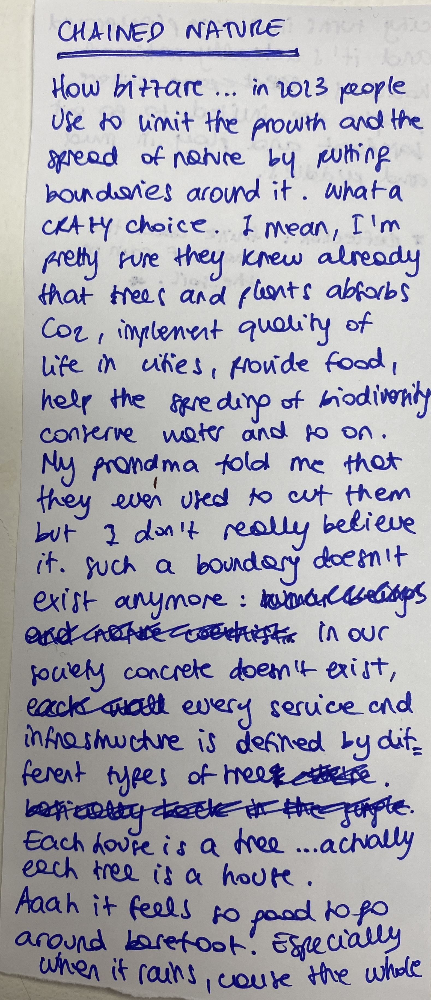

---
hide:
    - toc
---

#Designing for the Next Billion Seconds

Internet of things: internet of beings
Machine learning: human learning
User experience: human experience
Singularity: plurality
- Audrey Tang

Why do we use a decimal numeral system to count, measure and label everything? Numbers are the most fascinating human invention. The power of 10. We use it because it’s in our hand, it’s accessible to everyone.

How many a billion is? Many correct answers, depends on the context. One million million
How much? How many? How long? why?

What is everything?
The everything manifesto: designing for systemic changes, not solutions. Better everyday life choices both in personal and work life. Designing beyond borders, supernatural contexts to deal with environmental emergency. Simple solutions to complex issues.

Move slow and repair things
Connection between simple and complex
Reframing and evolving
Multiple futures

**A day in my post technological life**

I’ll be 51 year old, living half of my days in nature, growing my own food, doing ceramic, surrounded by people that I love, reconnecting with nature and enjoying the sound of the sea waves. Probably in an island in front of the land. The other half of my days I would be living in the city, working and enjoying city life, even if the weather would be very dry and hot. One food in capitalism and on foot out of it.
I would wake up very early to take, each day, a picture of the sunrise, to continue my research on how much the colours of the sunrise change in each season and year. Then home made yogurt and granola, while listening to the news (a podcast).
When in the city, just moving around by bike and public transportation, going to the eco social design collective where I work, and enjoying the time with my colleagues, and after going out for drinks together once in a while, or music, events, or cinema, paying with my phone. Cash is not a thing anymore. In the island walking barefoot, go to the beach, collect food from trees, cook, doing ceramic and explore. I don’t use money on the island, just barter and exchange. I don’t use either phone or watch. Time is dictated by the sun and personal needs. Eating when hungry, going to sleep when tired.

