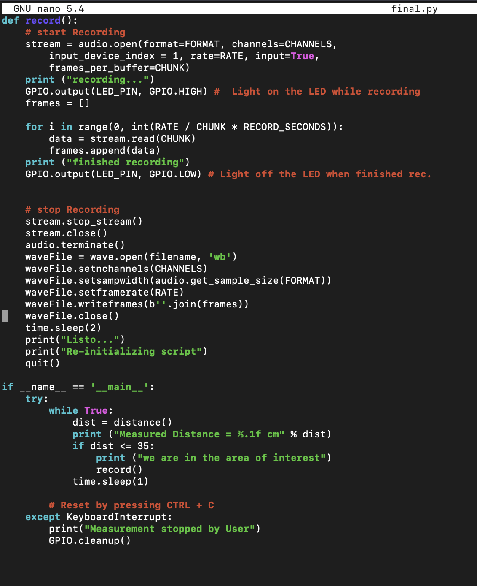

---
hide:
    - toc
---

#Prototyping for Design

#MICRO CHALLENGE II

Repo: https://github.com/clodbe0/Microchallenge-II/edit/main/README.md

Our area of interest is the social aspect of the weak signal of drug assumption at music festivals. Substance use at music festivals, dance clubs, and raves is a well-known fact, and we do not intend to justify it. Instead, we focus on creating a non-judgmental and open-minded environment that encourages pragmatic conversation around the use of psychoactive substances. To achieve this, we want to use interactive design and tools to gather data and personal experiences related to the topic. We want to increase dialogue around the topic, which can help reduce stigma and discrimination, mitigating harm.

The main idea is to develop a safe and inclusive space for discussing the use of psychoactive substances. Through a physical installation and a complementary VR experience, users can share their personal experiences anonymously and learn from others' stories in a controlled environment. Our aim is to foster an immersive and collaborative dialogue on this topic. We wanna help people to communicate their opinion and experiences about drugs in a way that can allow them to feel comfortable in sharing personal opinions and experiences.

During the micro challenge II we developed the physical installation called "The Confessional". We're developing the VR indipendently. The Confessional is a wood structure (CnC, lasercut) that can host one person at a time. It's not supposed to fully cover the person, cause we don't believe in shame or guilt in drug assumption, but just to isolate in order to create a personal space that helps a flow of thoughs. As the user walks in, a blu led turns on and the recording starts. We give people 100 seconds to share their experience, the limit of time is needed because the recordings are then gonna be used in the VR immersive installation.
Since that we are a group or two, we decided to devide the tasks:

physical structure: we already had the CnC and laser cut parts. Since that we're planning to move the structure around, we have to make it removable cause it would be too heavy to carry around as one whole piece. We're gonna use screws but we don't want to ruin the wood, so we decided to 3D print support pieces for the planks with inserters for the screws.
rasbperry pi and python to program the fuction or light, recording and distance, using a LED, a ultrasonic distance detector and a microphone.

*PHYSICAL STRUCTURE*

Material needed:

plywood 4mm (lasercut)
wood 15mm (CnC)
3D printed plastic junctions
screws
m5 inserts
m4 inserts
We first designed together the physical structure on Rhino, struggling with the quantity of material that we had available and the average sizes of human beings. (170 - 180 cm). In order not to waste material, we manage to optimise the space available on the board.

Problem 1: At first, we were planning to do it all with the CnC but due to the limit of material available we decided to do the top part laser cut in plywood.

Problem 2: Once that it was printed we had to reduce the size of average 20cm ish, fortunately we designed the bottom part so that I could be shorten up.

Problem 3: We tried to put the pieces together, the structure was pretty solid and stable but for safety reasons we preferred to add some screws BUT we still wanted the structure to be adjustable on the spot (we plan to carry it around and as a whole would be too heavy and not very smart). We decided to 3D print support pieces for the screws, not to damage the wood and so that the structure is easily transportable because designed to be disassembled.

Problem 4: We run out of inserts. Bought them very last minute.

Problem 5: When we tried to drill in the screws on the 4mm plywood, it was either breaking or slipping aside. We fixed the Rhino file adding holes to the design.

Problem 6: Some of our structure 3D Printed pieces were too brittle, we printed them again with a greater amount of walls.

Problem 7: Some pieces were not Parametrically designed, so we did not know where to drill at times. This made our design process longer, and allowed for mistakes. Next time we should include the drilled holes in the CNC and Laser cut designs, and also use precise measurements when modelling our 3D pieces.

We did solve this issue for the laser cut parts (since laser cutting is fast), but with the CNC cut planks we struggled a lot.

*RASPBERRY PI*

Material needed:

raspberyy pi
breadboard
USB microphone
3 330 Ohm resistors
1 led
male to female wires

We started working on three different files, one for the distance detector, one for the led, one for the microphone to then blend them together in a final one.

In the first one we connected the detector to measure distances, and we set an area that represents our area of interest when we want the recording to start. Since that the lateral measure of our box is 40 cm we set the area of interest as 35 cm, so that the area is defined once that the person is already inside.

The script for the led was the most simple one, basically just connecting the LED with an on and off function.
The last script is the one that triggered us the most. Problem 1: We first started with a microphone that unfortunately didn't work. Then we switched to usb headphones with microphone (we're just using the microphone). We managed to actually record, to play the recording we first moved them in a USB and then in the laptop to check.

*FURTHER DEVELOPMENTS*

All the stories shared in The Confessional will then be translated into a VR experience, which we are going to exhibit at Mostra Festival and we aim to exhibit at Sonar+D. The whole project is called "Unfolding Conversations". We recognize that the use of substances is both literary and personal, where one's experience is only partially narrated by literature on a substance and its effects. Therefore, we believe that personal conversations are essential when discussing the topic. Unfolding Conversation thus aims to provide a safe space for people to share their experiences, creating a database of personal narratives which will be exhibited in subsequent installations. Through the power of storytelling, we hope to promote understanding, reduce stigma and discrimination, and create a more accepting and open attitude towards psychoactive substance consumption, especially in a music fest environment where people might be more keen to be involved in the topic, looking for further safety and comfort.

**Reflections**
I am frustrated and sad. I am frustrated because I dedicated a lot of effort and time during the four days of challenge to understand Atom and how the Rasperry Pi work and literally 10 minutes before the final presentation in didn't work anymore and I don't have even one video that showed that I actually succeeded in something. We were planning to bring the system at Mostra and Sonar festival but since that last minute it dropped out we decided to replace it with a back up plan.
Overall, the week was very demanding. We are a small group, actually we're a pair ;) so we split the work in two. We managed to deal with that by working on different tasks but always sharing with each other what was going on and helping / supporting each other when needed. There's a very good work balance with Mari, we understand each other and we give each other honest opinions.
As always, it was really nice to learn something new by doing it and this time we really pushed forward by doing something new that we were actually very scared about, and we succeeded even if we couldn't show the result.
