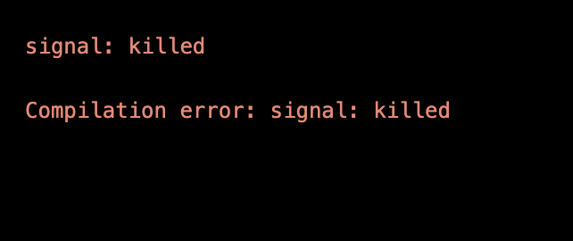

---
hide:
    - toc
---

#Prototyping for Design

**WHAT'S HAPPENING SOMEBODY HELP ME PLEASE**

I still didn't manage to make a connection with the board in my own laptop but I'm exercising a little with my friends's. Recently it was Korbinian birthday and we decided to play the "happy birthday" tone on Arduino. Check the video.

https://vimeo.com/796948387

**FIST ATTEMPT WITH WOMP**

Since that I already know a little bit how to use Rhino, I decided to dedicate some time on learning how to use Womp, a 3D modeling program much more intuitive and simple.  
For a bigger project, I'm working on psychedelics graphics and now I'm trying to give them a 3D life. Here's the first attempt!

So this is the original graphic:

And here's the first attempt on Womp, I have to say that I struggled a little with the use of the curve, because it works with points and I had to control each single one of them.

 Make a pressfit prototype of your choice or some molds.

 (always save it as rhino 5)
