---
hide:
    - toc
---


#Prototyping for Design


**WHAT'S HAPPENING SOMEBODY HELP ME PLEASE**


I still didn't manage to make a connection with the board in my own laptop but I'm exercising a little with my friends's. Recently it was Korbinian birthday and we decided to play the "happy birthday" tone on Arduino. Check the video.

https://vimeo.com/796948387


**Parametrize**

My first attempt with parametrize: a croissant!


**FIST ATTEMPT WITH WOMP**

Since that I already know a little bit how to use Rhino, I decided to dedicate some time on learning how to use Womp, a 3D modelling program much more intuitive and simple.  
For a bigger project, I'm working on psychedelics graphics and now I'm trying to give them a 3D life. Here's the first attempt!

So this is the original graphic:


And here's the first attempt on Womp, I have to say that I struggled a little with the use of the curve, because it works with points and I had to control each single one of them.


**MORSE CODE**
 Inputs and outputs. How to make a sensor and an actuator communicate with each other? With a LDS who's basically a resistor that reads the light in the room and then we can also use a normal LED to switch the light on and off.
 The morse code is needed to send data, information and command from LED to LDR.

 How to connect a board with a light sensor that can print graphs and the second one with a LED and a button? Basically what's supposed to happen is that the sensor manages to read the LED light and give a response to that by printing messages.

 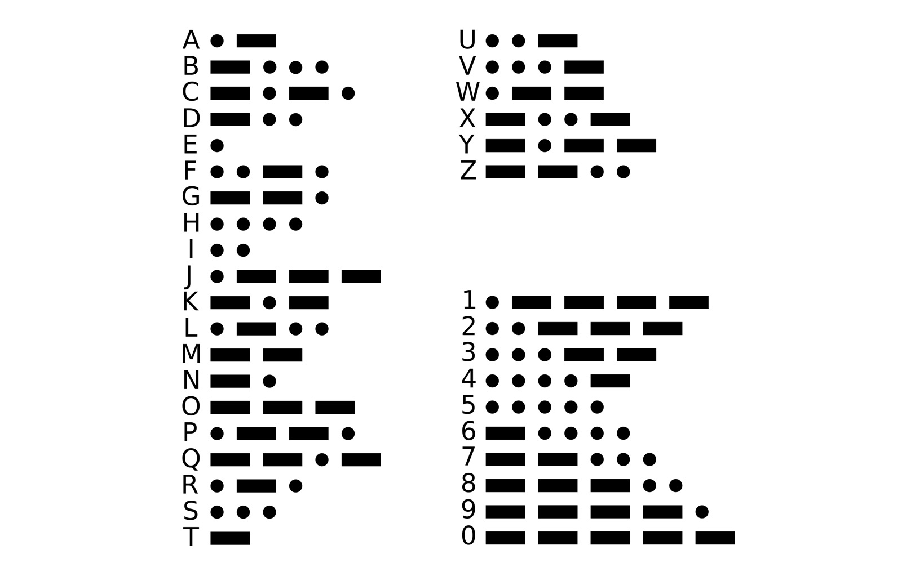


 How to connect a board with a light sensor that can print graphs and the second one with a LED and a button? Basically what's supposed to happen is that the sensor manages to read the LED light and give a response to that by printing messages.

  

```
int R2 = 10000;
float VIN = 3.0;

unsigned long startTime = 0;
unsigned long endTime = 0;
unsigned long interval = 0;

int ledState = 0;

void setup() {
 Serial.begin(9600);
}


void loop() {

 // read the input on analog pin 0:
 int sensorValue = analogRead(A3);

 if (sensorValue > 1000) {
   Serial.println("turn off the lights!");
   delay(1000);
 }

 else {
   Serial.println("lights off, checking for LED...");
   if (sensorValue > 100 && ledState == 0)  //if the led turns on
   {
     ledState = 1;
     Serial.println("the led turned on, I think!");
     startTime = millis();
     Serial.println("start time:");
     Serial.println(startTime);

     if (sensorValue < 100) {
       endTime = millis();
       Serial.println("end time: ");
       Serial.println(endTime);
       interval = endTime - startTime;
       Serial.println("interval: ");
       Serial.println(interval);

       Serial.println("The LED is back off, I think!");
       ledState = 0;
       delay(1000);

       if (interval < 1000) {
         Serial.println("SHORT");
         delay(1000);
         interval = 0;
       }

       else {
         Serial.println("LONG");
         delay(1000);
         interval = 0;
       }
     }
   }
   // Convert the analog reading (which goes from 0 - 1023) to a voltage (0 - 5V):
   //float voltage = sensorValue * (3.0 / 1023.0);

   // Get the value of R1
   //int ldr = ((R2 * VIN) / voltage) - R2;

   // print out the value you read:
   //Serial.println(sensorValue);
   //Serial.print("voltage: ");
   //Serial.println(voltage);
   //Serial.print("LDR value: ");
   //Serial.println(ldr);
 }
```


**LASER CUTTING**

Exploring some laser cutting (and finally actually learning how to use the machine [almost independently]) first on cardboard to understand and explore, then on plywood and eventually on acrylic. It takes a lot of time but it's oddly satisfying to watch I have to admit.


Then I used the laser cutting to cut plywood in order to create the upper part of a confessional, it's kind of a box and I've designed the angles of the box in order that they can be joined together just by the design.

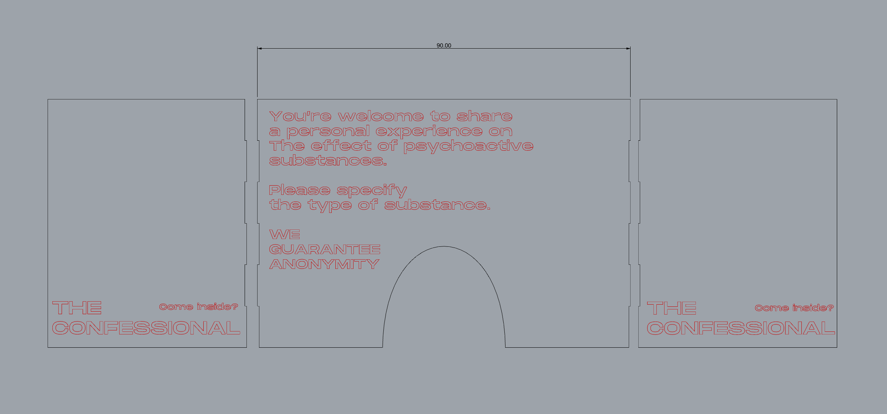

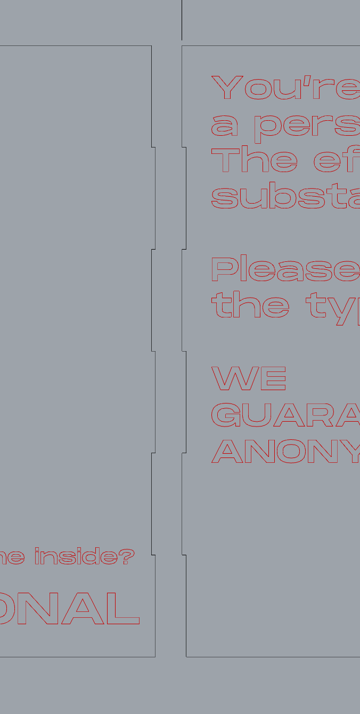

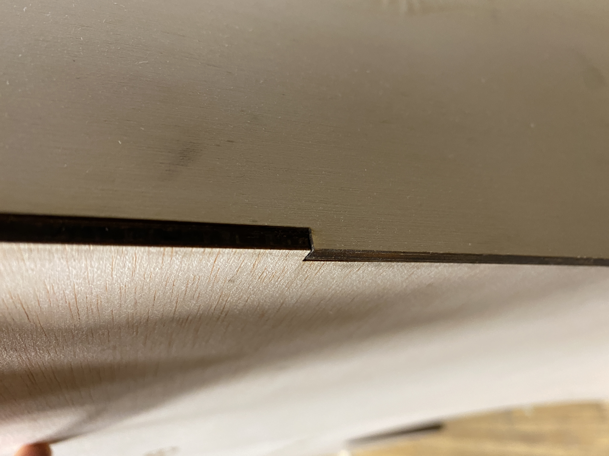


#MICRO CHALLENGE I

We wanna help people to communicate their ideas, opinion and experience about drugs without using the voice, by creating a tool that could help them speak without speaking. Why? Because sometimes seems hard to talk and express opinions about specific topics, if it feels like they are being denied by society and there's no enough freedom to bring the conversation to the table, and especially to share a personal experience, positive or negative an habit or even an addiction related to something illegal and usually misread.


The lack of communication and dialogue in the topic brings a huge lack of awareness and information in the topic itself. Also, sharing can prevent other people’s harm.

We want people to feel comfortable in sharing personal opinions about drugs, that's why we designed a simple tool, a sharing board, that it's seen multiple times in different occasions, as a way to normalise the topic. We wanna give a non judgmental tool to gather data about drug use in different locations (street, music festival, bars, uni).

We designed the board starting by a topography map to give a modularity aspect and not to limit ourselves with a squared board. Also, the shapes of the topography allows to create different shapes and adjust the board by preference.Once that the shapes were fixed we developed a flow of answers that could represent statements related to drug and then we placed them in the rhino file.
We first prototyped the board in cardboard to test it out and then we laser cut it on plywood. The whole board that starts with a question: "Do you do drugs?" The YES and NO answers correspond to a thread and then the journey begins as a flow of answers to communicate personal opinions and experiences. Close to each answer we put a nail were a thread can be attached as a "yes I do".


THE INVISIBLE ANSWERS


We know that being honest, with themselves and others, about drugs is not easy, so in order to allow people to feel more comfortable about sharing we came up with the idea of the invisible answers, more intimate and difficult statements that might be hard to point out in front of others. These answers are not laser cut in the board, instead we printed weird shaped stickers (that are connected to aesthetic of the project) on blue vinyl and then sticked them on the board.
Using an augmented reality development package and ARKit, we then developed an app which allows you to individually scan each icon (stickers), and in return, the app displays the "invisible answers" on your phone. The app however, is limited to individual deployment, thus we have to deploy it on each IOS device by building it through XCode. Having said that, the code is currently limited to IOS builds.


So eventually each participant could feel like living in an open space where to share, even more intimate and private stuff related to drugs. This project is part of a wider project called DRUGS YOU BETTER KNOW that soon will try to participate to a Sonar open call for artistic and technological projects working at the intersection between art, technology, sciences, and society, aiming for ideas that see the development of AI, VR, AR. We're also developing a VR immersive experience to break walls of prejudice and conservatism to open dialogue and reduce drug harms at festivals.


*Self evaluation and reflection*
This whole week was very important for the development of a project that's part of a bigger picture, of something that we're trying to bring out of IaaC's walls and show it outdoor in specific context.
Having the opportunity to actually prototype something gave us the opportunity to face pros and limits of materials and techniques that we might used. We managed to get comfortable with many tools in the FabLab that before we didn't know how to deal with.
This specific output is not going to evolve but it widened many ideas related to it. It was really challenging but satisfying to finally learning how to actually use machines in the FabLab and putting in practice the "learn by doing" method.
I think we could have pushed our limits more and going a bit further, maybe exploring some programming with Arduino, I guess we'll leave time for that in the second Micro Challenge Week.


**3D PRINTING**

First experiment with the 3d printer, modelled a volcano try with Rhino, embedded it in Cura and finally 3D printed it. Took 1.5 hours.


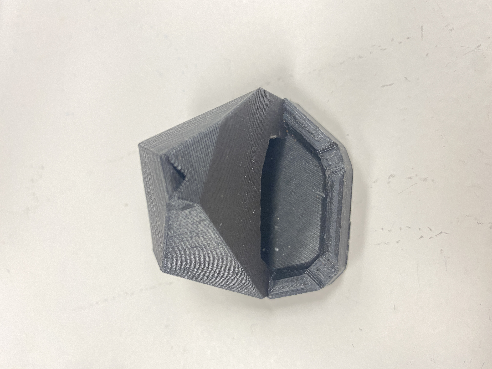


See the scanning **[here](https://vimeo.com/808271078)**


#Communication between laptop

Throughout the Wifi broadcasting and the ESP32 feather, we typed messages on Arduino serial monitor and, after connecting 4 laptop in the class to the wifi we could communicate via MQTT to the broker.


#Machine vs Machine


**BLINKING LED**


FIRST TASK: basically, make it blink!


```
/*
  Blink

  Turns an LED on for one second, then off for one second, repeatedly.

*/

// the setup function runs once when you press reset or power the board


#define LED 14 //int LED = 14; practically these two have the same output put they come to the result in different ways.

void setup() {
  // initialize digital pin LED_BUILTIN as an output.
  pinMode(LED, OUTPUT);
}

// the loop function runs over and over again forever
void loop() {
  digitalWrite(LED, HIGH);  // turn the LED on (HIGH is the voltage level)
  delay(1000);                      // wait for a second
  digitalWrite(LED, LOW);   // turn the LED off by making the voltage LOW
  delay(1000);                      // wait for a second
}
```

SECOND TASK: having it blinking by command
Be aware that mac and windows work different when copying a line, so need to adapt it.
We can make some changes, blink fast, blink slow, how many blinks... Giving more parameters to Arduino basically.

"Blink fast" as a command in order to hopping


```
#include "Arduino.h"
#define LED_PIN 14

// the setup function runs once when you press reset or power the board
void setup() {
  // initialize digital pin LED_BUILTIN as an output.
  pinMode(LED_PIN, OUTPUT);
  Serial.begin(9600);
}

void blink () {
  digitalWrite(LED_PIN, HIGH);   // turn the LED on (HIGH is the voltage level)
  delay(1000);                       // wait for a second
  digitalWrite(LED_PIN, LOW);    // turn the LED off by making the voltage LOW
  delay(1000);                       // wait for a second
}

void hopping () {
  digitalWrite(LED_PIN, HIGH);   // turn the LED on (HIGH is the voltage level)
  delay(100);                       // wait for a second
  digitalWrite(LED_PIN, LOW);    // turn the LED off by making the voltage LOW
  delay(100);                       // wait for a second
  digitalWrite(LED_PIN, HIGH);   // turn the LED on (HIGH is the voltage level)
  delay(100);                       // wait for a second
  digitalWrite(LED_PIN, LOW);    // turn the LED off by making the voltage LOW
  delay(100);  
  digitalWrite(LED_PIN, HIGH);   // turn the LED on (HIGH is the voltage level)
  delay(100);                       // wait for a second
  digitalWrite(LED_PIN, LOW);    // turn the LED off by making the voltage LOW
  ```

  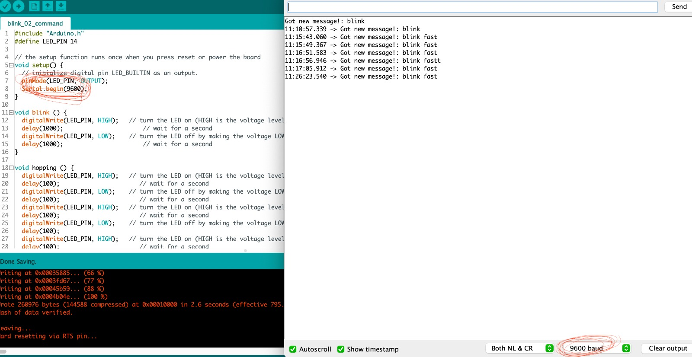


  THIRD TASK: adding an effect - Breathe


  ```
  #include "Arduino.h"
#include "jled.h"
#define LED_PIN 14

// the setup function runs once when you press reset or power the board
void setup() {
  // initialize digital pin LED_BUILTIN as an output.
  Serial.begin(9600);
}

// Jled object.
// More information here: https://github.com/jandelgado/jled#usage
JLed led = JLed(LED_PIN);

// Basic blink
void blink () {
  led.Blink(1000, 600).Repeat(3);
}

// Smooth breathing
void breathe() {
  led.Breathe(1000).Repeat(3);
}

// the loop function runs over and over again forever
void loop() {

  if (Serial.available()) {
    // Read the string and clean it up
    String newMsg = Serial.readString();
    newMsg.trim();

    // For debugging purposes, print it
    Serial.print("Got new message!: ");
    Serial.println(newMsg);

    // Blink if we tell it to!
    if (newMsg.equals("blink")){
      blink();
    // Or breathe!
    } else if (newMsg.equals("breathe")) {
      breathe();
    }
  }

  // Do not remove this line!
  led.Update();

}
  ```


  FOURTH TASK: A way so that we can listen to the same command at the same time. One hits the button, all the LDS respond.

  ```
#include "jled.h"
#define LED_PIN 14

// New code for MQTT!
//-------------------
#include <WiFi.h>
#include <PubSubClient.h>

const char* ssid = "Iaac-Wifi";
const char* password = "EnterIaac22@";
WiFiClient wifiClient;

const char* mqttBroker = "mqtt-staging.smartcitizen.me";
const char* mqttClientName = "s&c";
const char* mqttClientUser = "fablabbcn102";
const char* mqttClientPass = "";
const char* topicToSub = "lab";
// const char* topicToPub = "lab";
PubSubClient mqttClient(wifiClient);
//-------------------

// Jled object.
// More information here: https://github.com/jandelgado/jled#usage
JLed led = JLed(LED_PIN);

//-------------------
// Add more animations here!
// Basic blink
void blink () {
  led.Blink(1000, 600).Repeat(3);
}
```


#CnC

Using Cnc to prototype our confessional.

First step: Rhino render to understand measures and proportions. The design changed a lot in order to fit in in the board we had available and also to make it at light as possible. We designed a Confessional which is part of our main project about drug consumption. We'll use the piece as a free space for people to tell stories about their experience with drugs. Sorry MDEF for not have built something for class... This is needed for a bigger project, we'll hope that Sonar likes it!


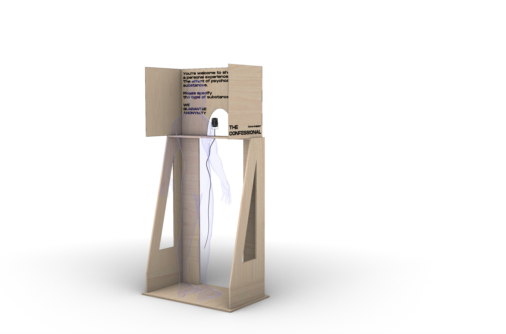

Second step: adapt the file to CnC configuration, so start by making 2D of the file. The walls of the Confessional will be joined together so we had to figure out the finger tenons joinery system.

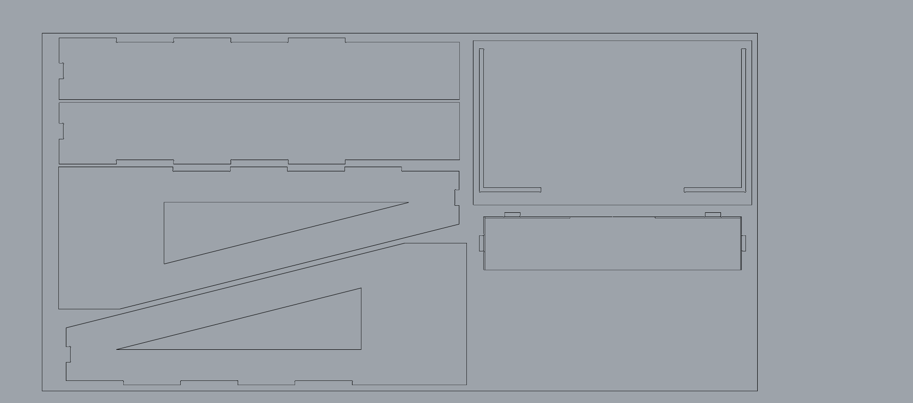

Third step: understand how to set the Machine.

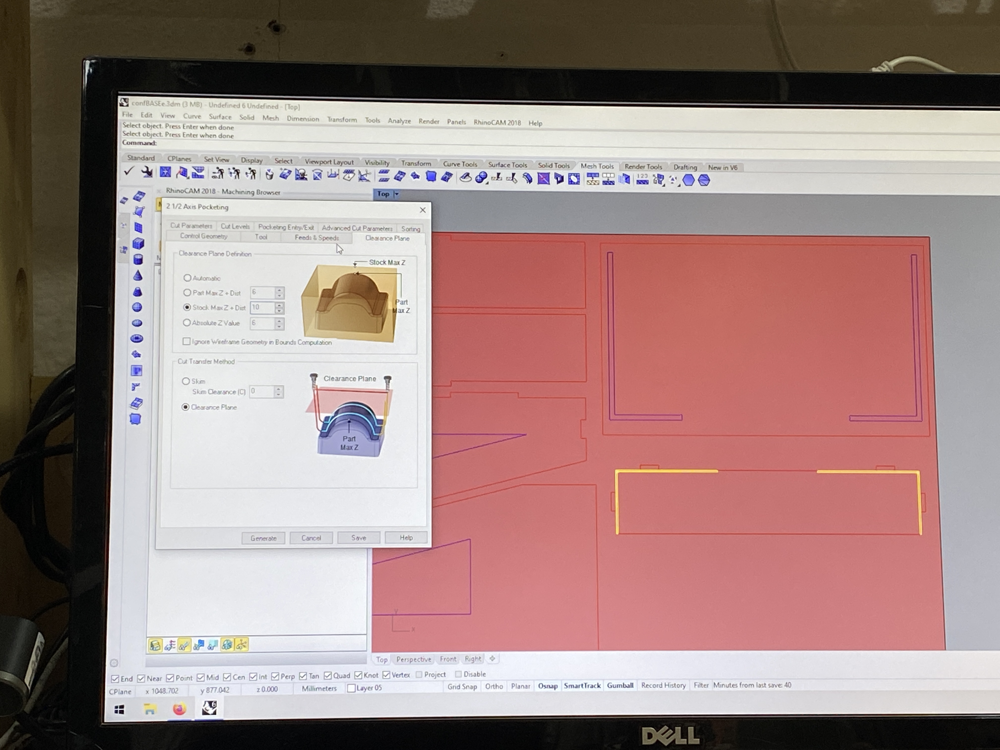

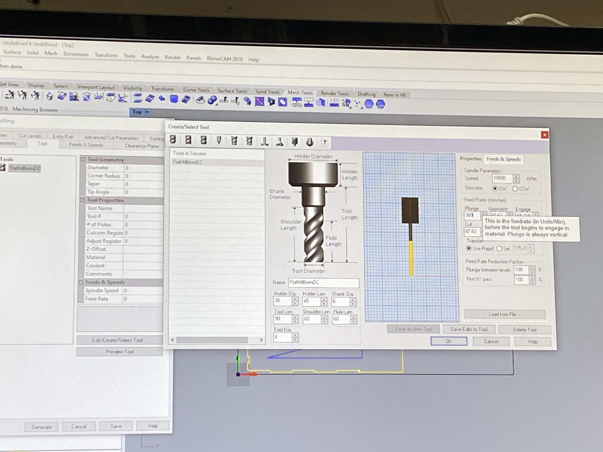

Fourth step: let's do thiiiiiiiiiiiiiiis. I have to say that this was way more complicated than expected. So many details to consider that just don't come to mind when 3D modelling, so many tiny adjustments to make at the very last minute. Part of the game I guess.


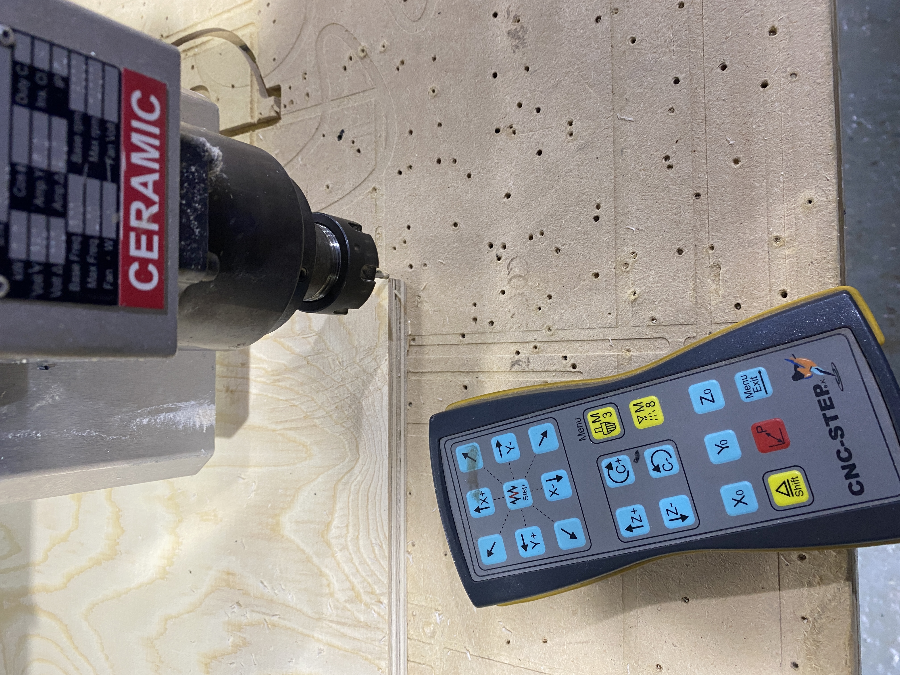


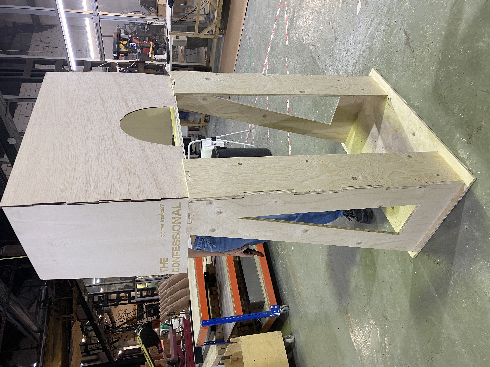

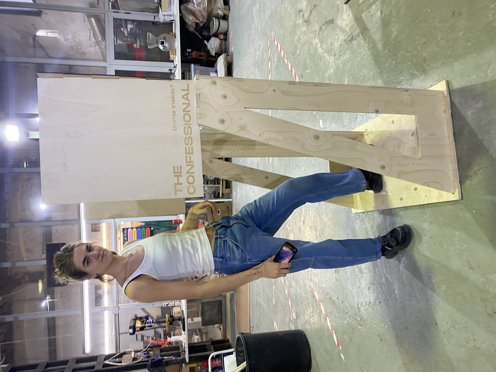


#MICRO CHALLENGE II
Our area of interest is the social aspect of the weak signal of drug assumption at music festivals. Substance use at music festivals, dance clubs, and raves is a well-known fact, and we do not intend to justify it. Instead, we focus on creating a non-judgmental and open-minded environment that encourages pragmatic conversation around the use of psychoactive substances. To achieve this, we want to use interactive design and tools to gather data and personal experiences related to the topic. We want to increase dialogue around the topic, which can help reduce stigma and discrimination, mitigating harm.

The main idea is to develop a safe and inclusive space for discussing the use of psychoactive substances. Through a physical installation and a complementary VR experience, users can share their personal experiences anonymously and learn from others' stories in a controlled environment. Our aim is to foster an immersive and collaborative dialogue on this topic. We wanna help people to communicate their opinion and experiences about drugs in a way that can allow them to feel comfortable in sharing personal opinions and experiences.

During the micro challenge II we developed the physical installation called "The Confessional". We're developing the VR indipendently. The Confessional is a wood structure (CnC, lasercut) that can host one person at a time. It's not supposed to fully cover the person, cause we don't believe in shame or guilt in drug assumption, but just to isolate in order to create a personal space that helps a flow of thoughs. As the user walks in, a blu led turns on and the recording starts. We give people 100 seconds to share their experience, the limit of time is needed because the recordings are then gonna be used in the VR immersive installation.
Since that we are a group or two, we decided to devide the tasks:

physical structure: we already had the CnC and laser cut parts. Since that we're planning to move the structure around, we have to make it removable cause it would be too heavy to carry around as one whole piece. We're gonna use screws but we don't want to ruin the wood, so we decided to 3D print support pieces for the planks with inserters for the screws.
rasbperry pi and python to program the fuction or light, recording and distance, using a LED, a ultrasonic distance detector and a microphone.


*PHYSICAL STRUCTURE*

Material needed:

plywood 4mm (lasercut)
wood 15mm (CnC)
3D printed plastic junctions
screws
m5 inserts
m4 inserts
We first designed together the physical structure on Rhino, struggling with the quantity of material that we had available and the average sizes of human beings. (170 - 180 cm). In order not to waste material, we manage to optimise the space available on the board.

Problem 1: At first, we were planning to do it all with the CnC but due to the limit of material available we decided to do the top part laser cut in plywood.

Problem 2: Once that it was printed we had to reduce the size of average 20cm ish, fortunately we designed the bottom part so that I could be shorten up.

Problem 3: We tried to put the pieces together, the structure was pretty solid and stable but for safety reasons we preferred to add some screws BUT we still wanted the structure to be adjustable on the spot (we plan to carry it around and as a whole would be too heavy and not very smart). We decided to 3D print support pieces for the screws, not to damage the wood and so that the structure is easily transportable because designed to be disassembled.


Problem 4: We run out of inserts. Bought them very last minute.

Problem 5: When we tried to drill in the screws on the 4mm plywood, it was either breaking or slipping aside. We fixed the Rhino file adding holes to the design.

Problem 6: Some of our structure 3D Printed pieces were too brittle, we printed them again with a greater amount of walls.

Problem 7: Some pieces were not Parametrically designed, so we did not know where to drill at times. This made our design process longer, and allowed for mistakes. Next time we should include the drilled holes in the CNC and Laser cut designs, and also use precise measurements when modelling our 3D pieces.

We did solve this issue for the laser cut parts (since laser cutting is fast), but with the CNC cut planks we struggled a lot.

*RASPBERRY PI*

Material needed:

raspberyy pi
breadboard
USB microphone
3 330 Ohm resistors
1 led
male to female wires

We started working on three different files, one for the distance detector, one for the led, one for the microphone to then blend them together in a final one.

In the first one we connected the detector to measure distances, and we set an area that represents our area of interest when we want the recording to start. Since that the lateral measure of our box is 40 cm we set the area of interest as 35 cm, so that the area is defined once that the person is already inside.

The script for the led was the most simple one, basically just connecting the LED with an on and off function.
The last script is the one that triggered us the most. Problem 1: We first started with a microphone that unfortunately didn't work. Then we switched to usb headphones with microphone (we're just using the microphone). We managed to actually record, to play the recording we first moved them in a USB and then in the laptop to check.


*FURTHER DEVELOPMENTS*

All the stories shared in The Confessional will then be translated into a VR experience, which we are going to exhibit at Mostra Festival and we aim to exhibit at Sonar+D. The whole project is called "Unfolding Conversations". We recognize that the use of substances is both literary and personal, where one's experience is only partially narrated by literature on a substance and its effects. Therefore, we believe that personal conversations are essential when discussing the topic. Unfolding Conversation thus aims to provide a safe space for people to share their experiences, creating a database of personal narratives which will be exhibited in subsequent installations. Through the power of storytelling, we hope to promote understanding, reduce stigma and discrimination, and create a more accepting and open attitude towards psychoactive substance consumption, especially in a music fest environment where people might be more keen to be involved in the topic, looking for further safety and comfort.


**Reflections**
I am frustrated and sad. I am frustrated because I dedicated a lot of effort and time during the four days of challenge to understand Atom and how the Rasperry Pi work and literally 10 minutes before the final presentation in didn't work anymore and I don't have even one video that showed that I actually succeeded in something. We were planning to bring the system at Mostra and Sonar festival but since that last minute it dropped out we decided to replace it with a back up plan.
Overall, the week was very demanding. We are a small group, actually we're a pair ;) so we split the work in two. We managed to deal with that by working on different tasks but always sharing with each other what was going on and helping / supporting each other when needed. There's a very good work balance with Mari, we understand each other and we give each other honest opinions.
As always, it was really nice to learn something new by doing it and this time we really pushed forward by doing something new that we were actually very scared about, and we succeeded even if we couldn't show the result. 
