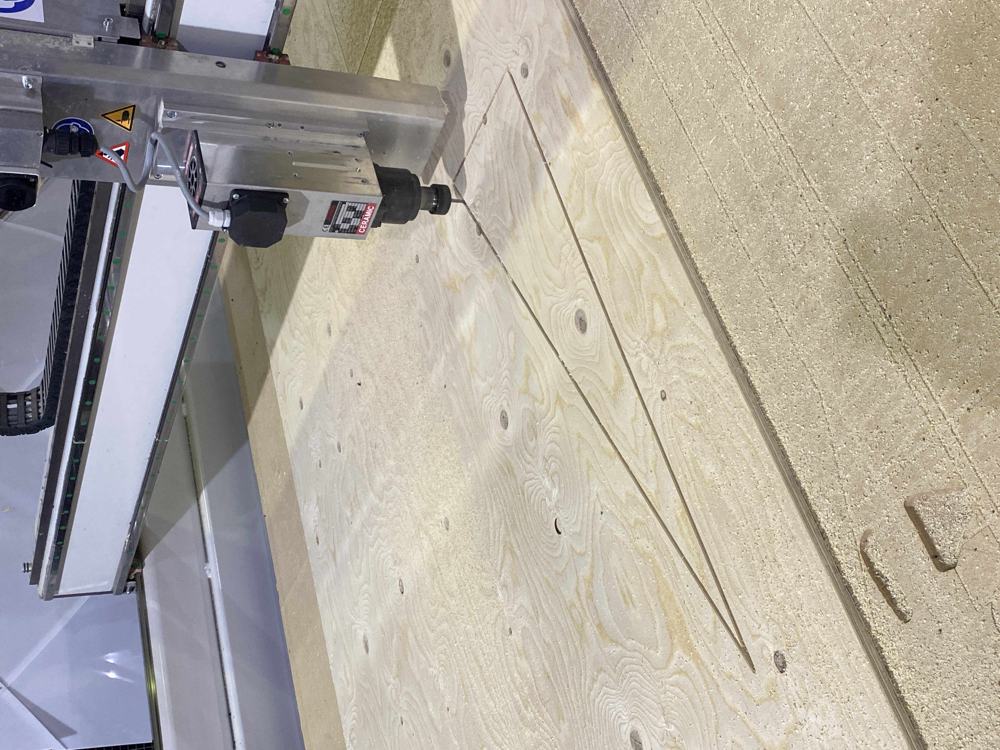

---
hide:
    - toc
---


#Prototyping for Design


**WHAT'S HAPPENING SOMEBODY HELP ME PLEASE**


I still didn't manage to make a connection with the board in my own laptop but I'm exercising a little with my friends's. Recently it was Korbinian birthday and we decided to play the "happy birthday" tone on Arduino. Check the video.

https://vimeo.com/796948387


**Parametrize**

My first attempt with parametrize: a croissant!


**FIST ATTEMPT WITH WOMP**

Since that I already know a little bit how to use Rhino, I decided to dedicate some time on learning how to use Womp, a 3D modelling program much more intuitive and simple.  
For a bigger project, I'm working on psychedelics graphics and now I'm trying to give them a 3D life. Here's the first attempt!

So this is the original graphic:


And here's the first attempt on Womp, I have to say that I struggled a little with the use of the curve, because it works with points and I had to control each single one of them.


**MORSE CODE**
 Inputs and outputs. How to make a sensor and an actuator communicate with each other? With a LDS who's basically a resistor that reads the light in the room and then we can also use a normal LED to switch the light on and off.
 The morse code is needed to send data, information and command from LED to LDR.

 


**LASER CUTTING**

Exploring some laser cutting (and finally actually learning how to use the machine [almost independently]) first on cardboard to understand and explore, then on plywood and eventually on acrylic. It takes a lot of time but it's oddly satisfying to watch I have to admit.


**MICRO CHALLENGE WEEK**

We wanna help people to communicate their ideas, opinion and experience about drugs without using the voice, by creating a tool that could help them speak without speaking. Why? Because sometimes seems hard to talk and express opinions about specific topics, if it feels like they are being denied by society and there's no enough freedom to bring the conversation to the table, and especially to share a personal experience, positive or negative an habit or even an addiction related to something illegal and usually misread.


The lack of communication and dialogue in the topic brings a huge lack of awareness and information in the topic itself. Also, sharing can prevent other people’s harm.

We want people to feel comfortable in sharing personal opinions about drugs, that's why we designed a simple tool, a sharing board, that it's seen multiple times in different occasions, as a way to normalise the topic. We wanna give a non judgmental tool to gather data about drug use in different locations (street, music festival, bars, uni).

We designed the board starting by a topography map to give a modularity aspect and not to limit ourselves with a squared board. Also, the shapes of the topography allows to create different shapes and adjust the board by preference.Once that the shapes were fixed we developed a flow of answers that could represent statements related to drug and then we placed them in the rhino file.
We first prototyped the board in cardboard to test it out and then we laser cut it on plywood. The whole board that starts with a question: "Do you do drugs?" The YES and NO answers correspond to a thread and then the journey begins as a flow of answers to communicate personal opinions and experiences. Close to each answer we put a nail were a thread can be attached as a "yes I do".


THE INVISIBLE ANSWERS


We know that being honest, with themselves and others, about drugs is not easy, so in order to allow people to feel more comfortable about sharing we came up with the idea of the invisible answers, more intimate and difficult statements that might be hard to point out in front of others. These answers are not laser cut in the board, instead we printed weird shaped stickers (that are connected to aesthetic of the project) on blue vinyl and then sticked them on the board.
Using an augmented reality development package and ARKit, we then developed an app which allows you to individually scan each icon (stickers), and in return, the app displays the "invisible answers" on your phone. The app however, is limited to individual deployment, thus we have to deploy it on each IOS device by building it through XCode. Having said that, the code is currently limited to IOS builds.


So eventually each participant could feel like living in an open space where to share, even more intimate and private stuff related to drugs. This project is part of a wider project called DRUGS YOU BETTER KNOW that soon will try to participate to a Sonar open call for artistic and technological projects working at the intersection between art, technology, sciences, and society, aiming for ideas that see the development of AI, VR, AR. We're also developing a VR immersive experience to break walls of prejudice and conservatism to open dialogue and reduce drug harms at festivals.


**3D PRINTING**

First experiment with the 3d printer, modelled a volcano try with Rhino, embedded it in Cura and finally 3D printed it. Took 1.5 hours.


#Communication between laptop

Throughout the Wifi broadcasting and the ESP32 feather, we typed messages on Arduino serial monitor and, after connecting 4 laptop in the class to the wifi we could communicate via MQTT to the broker.


#Machine vs Machine


**BLINKING LED**


FIRST TASK: basically, make it blink!


```
/*
  Blink

  Turns an LED on for one second, then off for one second, repeatedly.

*/

// the setup function runs once when you press reset or power the board


#define LED 14 //int LED = 14; practically these two have the same output put they come to the result in different ways.

void setup() {
  // initialize digital pin LED_BUILTIN as an output.
  pinMode(LED, OUTPUT);
}

// the loop function runs over and over again forever
void loop() {
  digitalWrite(LED, HIGH);  // turn the LED on (HIGH is the voltage level)
  delay(1000);                      // wait for a second
  digitalWrite(LED, LOW);   // turn the LED off by making the voltage LOW
  delay(1000);                      // wait for a second
}
```

SECOND TASK: having it blinking by command
Be aware that mac and windows work different when copying a line, so need to adapt it.
We can make some changes, blink fast, blink slow, how many blinks... Giving more parameters to Arduino basically.

"Blink fast" as a command in order to hopping


```
#include "Arduino.h"
#define LED_PIN 14

// the setup function runs once when you press reset or power the board
void setup() {
  // initialize digital pin LED_BUILTIN as an output.
  pinMode(LED_PIN, OUTPUT);
  Serial.begin(9600);
}

void blink () {
  digitalWrite(LED_PIN, HIGH);   // turn the LED on (HIGH is the voltage level)
  delay(1000);                       // wait for a second
  digitalWrite(LED_PIN, LOW);    // turn the LED off by making the voltage LOW
  delay(1000);                       // wait for a second
}

void hopping () {
  digitalWrite(LED_PIN, HIGH);   // turn the LED on (HIGH is the voltage level)
  delay(100);                       // wait for a second
  digitalWrite(LED_PIN, LOW);    // turn the LED off by making the voltage LOW
  delay(100);                       // wait for a second
  digitalWrite(LED_PIN, HIGH);   // turn the LED on (HIGH is the voltage level)
  delay(100);                       // wait for a second
  digitalWrite(LED_PIN, LOW);    // turn the LED off by making the voltage LOW
  delay(100);  
  digitalWrite(LED_PIN, HIGH);   // turn the LED on (HIGH is the voltage level)
  delay(100);                       // wait for a second
  digitalWrite(LED_PIN, LOW);    // turn the LED off by making the voltage LOW
  ```

  


  THIRD TASK: adding an effect - Breathe


  ```
  #include "Arduino.h"
#include "jled.h"
#define LED_PIN 14

// the setup function runs once when you press reset or power the board
void setup() {
  // initialize digital pin LED_BUILTIN as an output.
  Serial.begin(9600);
}

// Jled object.
// More information here: https://github.com/jandelgado/jled#usage
JLed led = JLed(LED_PIN);

// Basic blink
void blink () {
  led.Blink(1000, 600).Repeat(3);
}

// Smooth breathing
void breathe() {
  led.Breathe(1000).Repeat(3);
}

// the loop function runs over and over again forever
void loop() {

  if (Serial.available()) {
    // Read the string and clean it up
    String newMsg = Serial.readString();
    newMsg.trim();

    // For debugging purposes, print it
    Serial.print("Got new message!: ");
    Serial.println(newMsg);

    // Blink if we tell it to!
    if (newMsg.equals("blink")){
      blink();
    // Or breathe!
    } else if (newMsg.equals("breathe")) {
      breathe();
    }
  }

  // Do not remove this line!
  led.Update();

}
  ```


  FOURTH TASK: A way so that we can listen to the same command at the same time. One hits the button, all the LDS respond.

  ```
#include "jled.h"
#define LED_PIN 14

// New code for MQTT!
//-------------------
#include <WiFi.h>
#include <PubSubClient.h>

const char* ssid = "Iaac-Wifi";
const char* password = "EnterIaac22@";
WiFiClient wifiClient;

const char* mqttBroker = "mqtt-staging.smartcitizen.me";
const char* mqttClientName = "s&c";
const char* mqttClientUser = "fablabbcn102";
const char* mqttClientPass = "";
const char* topicToSub = "lab";
// const char* topicToPub = "lab";
PubSubClient mqttClient(wifiClient);
//-------------------

// Jled object.
// More information here: https://github.com/jandelgado/jled#usage
JLed led = JLed(LED_PIN);

//-------------------
// Add more animations here!
// Basic blink
void blink () {
  led.Blink(1000, 600).Repeat(3);
}
```


#CnC

Using Cnc to prototype our confessional.

First step: Rhino render to understand measures and proportions. The design changed a lot in order to fit in in the board we had available and also to make it at light as possible. We designed a Confessional which is part of our main project about drug consumption. We'll use the piece as a free space for people to tell stories about their experience with drugs. Sorry MDEF for not have built something for class... This is needed for a bigger project, we'll hope that Sonar likes it!


Second step: adapt the file to CnC configuration, so start by making 2D of the file. The walls of the Confessional will be joined together so we had to figure out the finger tenons joinery system.


Third step: understand how to set the Machine.


Fourth step: let's do thiiiiiiiiiiiiiiis. I have to say that this was way more complicated than expected. So many details to consider that just don't come to mind when 3D modelling, so many tiny adjustments to make at the very last minute. Part of the game I guess.





