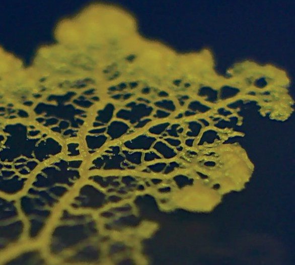
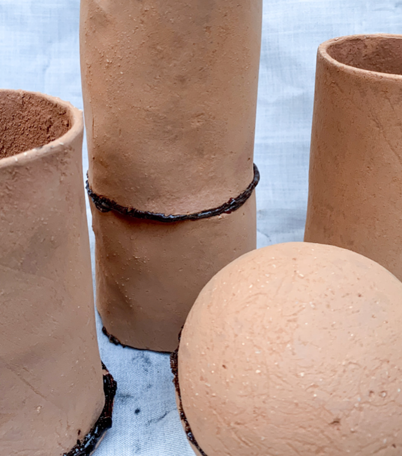
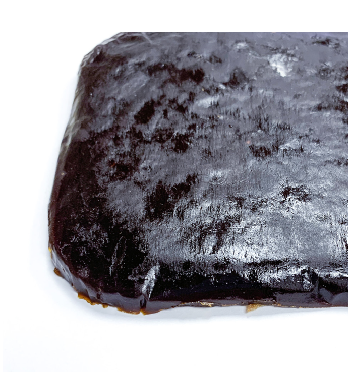
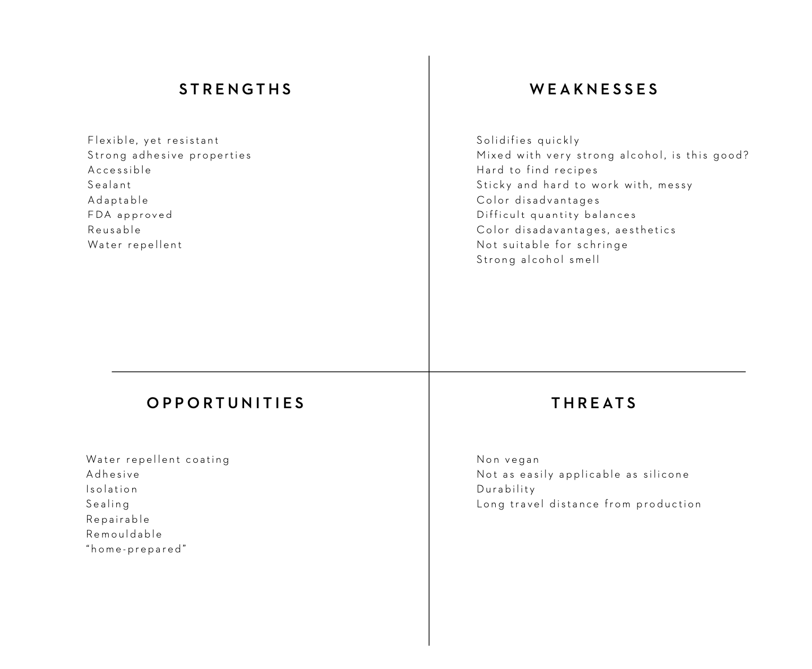

---
hide:
    - toc
---

#Remixing Materials

**Material around me: SILVER**

I chose silver because I wear it every day on my fingers, on my ears, on my nipple and on my belly. I’m surrounded by it.
Silver has the highest known electrical and thermal conductivity of all metals. It’s shiny, it tarnishes slowly in air because the sulfur reacts with the surface creating a black silver sulfide. The more you wear silver, the less you would have to clean it to remove the sulfide. Also, it has antibacterial properties, which open up to medical uses. We can say that the main properties are electrical conductivity and decorative beauty.
The silver that is used for jewellery is called sterling silver and contains 92.5% silver, the rest is usually other metals. Silver is also used for tableware, for mirrors, batteries, electrical contacts and medical alloys. The nano parts are used in the clothing industry for touchscreen fingertips. It’s a materials that was also very important in the development of film photography because the silver bromide is sensible to light. Also, in history it was used in the manufacture of coins.
Silver was started to be mined around 3000 BC and the material was refined by heating it up in a shallow cup, so that other materials like copper would oxidate.
In Medieval, German mines were the most effective source of Silver in Europe.

**Material from reference: slime molds from Dasha Plesen**

Chose it because it makes me believe in parallel words, futures and opens up my imaginations. Bacteria and organism that create funny shades and colors in around 4 weeks. They are eukaryotic organism which create spores. They were before classified as fungi but now switched to the group of Protista. All around the world, we can classify more than 900 species of molds. They feed on bacteria, fungi and microorganism that live on dead plant that’s why they contribute to decomposition.
We can find them in soil, lawns, fruits, forest ground but also in leaf mold in rain gutters and in air conditioners. Fun facts: they are saprophytic and lack chlorophyll. They are all harmless cause non toxic and actually beneficial, especially for the soil because they return nutriment to it.
Unfortunately, sometimes they can be seen as dirty or toxic because of the smell that they produce, but it’s because the tip of the stalk is covered with slime spores that attract flies.

**Ideal Material: CHOLT**

Chose it because I wish it existed, especially these days cause it’s pretty cold in Barcelona and I have my heating system broken. The name Cholt speaks for itself: it’s the combination of hot and cold. Why? Because this material keeps a neutral temperature of 15 degrees but when it touch with very cold or hot surfaces (body, other materials and so on…) it manages to balance that out by raising or lowering its own temperature. Examples: when your feet are really cold, as soon as Cholt is in touch with them it become 30 degrees. When your face is really hot in the summer it becomes 0 degrees.
The Cholt looks like wool, it comes in yarns so that people can create the shape that feet them better. It’s very soft and resistant thanks to the conductive fibers inside.
Scientists (me, myself and I) are trying to study further application of the material to fight climate change or environmental disasters, and try to adapt the shape to a larger scale.

**SHELLAC RESEARCH PROJECT**

Can there be a bio alternative to silicon?
Exploring bio based alternatives to silicone as a sealant and adhesive. Silicone or polysiloxane is a polymer made of siloxane that is typically colorless with oil or rubber-like properties. Silicones are used in sealants, adhesives, lubricants, medicine, cooking utensils, thermal insulation, and electrical insulation. It is used in large scale production and manufacturing generating large toxic substances. When speaking with experts, we identified Shellac as a potential alternative.
Shellac is a natural, organic resin from the insect, Laccifera lacca. During the insects reproductive cycle it feeds on the sap from certain trees indigenous to India and Thailand and secretes an amber colored resinous substance that is called “lac”. The resin forms a cocoon around the insect which serves to incubate the eggs she lays. This cocoon is the raw material for shellac and
is called “sticklac”, because it contains resin, parts of the twig and bug remains. The sticklac is washed and then refined either chemically or by hand, to produce the raw material available.
Shellac has been used for multiple purposes as sealants and adhesive throughout history. Through innovations of synthetic adhesives and sealants such as silicone etc the use of shellac is mostly as wood and furniture finish and conserving and restoring antiques. Commercially it is also used pharmaceutically, in confectionery and food coatings because of its FDA approval, shellac is used to coat apples and other fruits to make them shinier.

*EXPERIMENTS & INTERESTS*
Could shellac be used as a water resistant bio material as an alternative to silicone?
Can it be used as an adhesive?
What properties can it have as a sealant?
Can it be completely waterproof?
Can it be extruded?
Can it be reused?
Can it be used to glaze clay
Can it be used as a glue for broken clay (kintsugi)

*RECIPE I*
10g shellac
50ml alcohol 96%
Heat until shellac flakes dissolve
Very fluid and liquid consistence at first, then while getting cold it thickened and became more solid.

REFLECTIONS
Depending on the materials that are glued, the shellac as an adhesive has different properties. Between two pieces of synthetic fabric it creates and bond and the material becomes sturdier. Between dried leaves it has bonding properties, but takes longer to dry and is elastic.
It’s hard to apply and manipulate as it has a quick drying time for application, although if reheated or kept heated it is easily applicable

*RECIPE I*
10g shellac
50ml alcohol 96%
Heat until shellac flakes dissolve
Very fluid and liquid consistence at first, then while getting cold it thickened and became more solid.
REFLECTIONS
With one layer of shellac between two pieces of fabric it glues them together making the material sturdier. It creates a water resistant surface, but after a while the water can pass through the material.
Test more layers of shellac

*RECIPE II*
10g shellac
10ml alcohol
Heat until shellac flakes dissolve Apply between materials
Post heat with flame
REFLECTIONS
It had a very thick consistance and dried quickly making it difficult to work with. Between two pieces of dry porcelain dough it is hardend and acted as a strong binder. Connecting two pieces of Casein Bio Material as a kintsugi principle it has an elastic texture. If post heating with an open flame it hardens and binds pieces together

*RECIPE II*
10g shellac
10ml alcohol
Heat until shellac flakes dissolve Apply betweens materials
Post heat with flame
REFLECTIONS
We used the shellac as we would have with silicone to seal cracks and holes in a plastic container. It works to seal from water when
dry which took 2 days to dry completely. The aesthetics are not as pleasing, especially when on a white container as this one.

*RECIPE III*
10g shellac
30ml alcohol
Heat until shellac flakes dissolve Apply betweens materials
Post heat with flame REFLECTIONS
It had a thick consistancy where we experimented with connecting pieces of clay using the shellac as a sealer. To connect two pieces both sides had to have a layer of Shellac, therafter they easily stick together. It was again possible to reheat
the Shellac while in place on the clay to move the pieces and then harden it into place. This could be a great way to connect pieces. We also wanted to experiment with adding a thin layer to the clay to investigate if it created a water resistant layer, though the mixture was here too thick and did
not stick to large surfaces in clay.

*RECIPE III*
10g shellac
30ml alcohol
Heat until shellac flakes dissolve Apply betweens materials
Post heat with flame REFLECTIONS
Experimenting with casting Shellac and exploring thicker properties. Although the mixture was
very thin when heated it formed well in a mould and when dry, which took 2 days, it has shock absorbing, rubber like properties.

**Are there other alternatives to glue and silicone? Water resistant or water proof?**

Our main ambition was to find a water resistant, waterproof and gluey material that could be an alternative to silicone. We experimented with shellac as a bio substitute for silicon and explored the material with several properties and materials.
As results, we used the material on fabrics, raw clay, leaves, bio materials and plastic. We managed to achieve some of the properties that we were aiming for, but struggling with the manageability of shellac, as a material that changes consistence very fast as the temperature lows, and with the resistance of our achievements.
This experience was really important as part of a bigger project that see us working with water and exploring (probably clay) modules to collect and filter water and grow stuff.
We will further be exploring recipes with low temperature for less alcohol smell and experimenting with making water repellent clay without firing.
