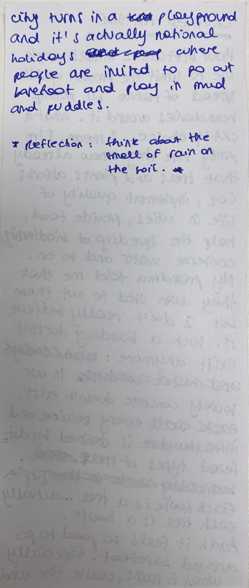

---
hide:
    - toc
---

#Distributed Design

12/04
Unfortunately I was not in class during the first day of Distributed Design, but I still went through the presentation and I got explained by my classmates the mushroom model.

13/04 Reflection tree

*Learning skills*
It was really interesting to apply to Reflection tree to my project Unfolding Conversation in order to understand and analyse its weak points. By self evaluating and giving score to my project I easily spotted fields were I could develop and grow more, like all of the environment aspect, because the project focuses more socially.

*Dynamics*
The best part of the class was listening and receiving opinions and suggestion by people that I usually don't work with. The group was very balanced and caring.

*Interactions*
I think the interactions are well connected with the dynamics, and I believe there was a good balance in both. I was on the same position as Stella, since that we share a very similar project, not the root of the project itself but how it behaves socially and environmentally, so to me was very important sharing with her but also listen to people who are stronger in points where I feel weak.

