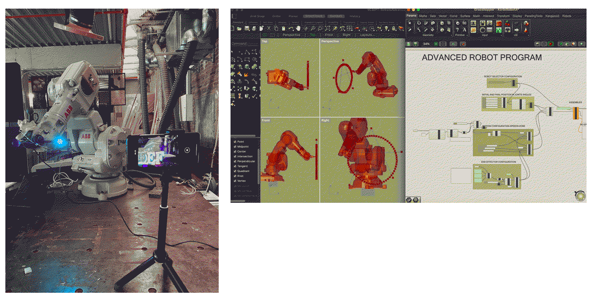
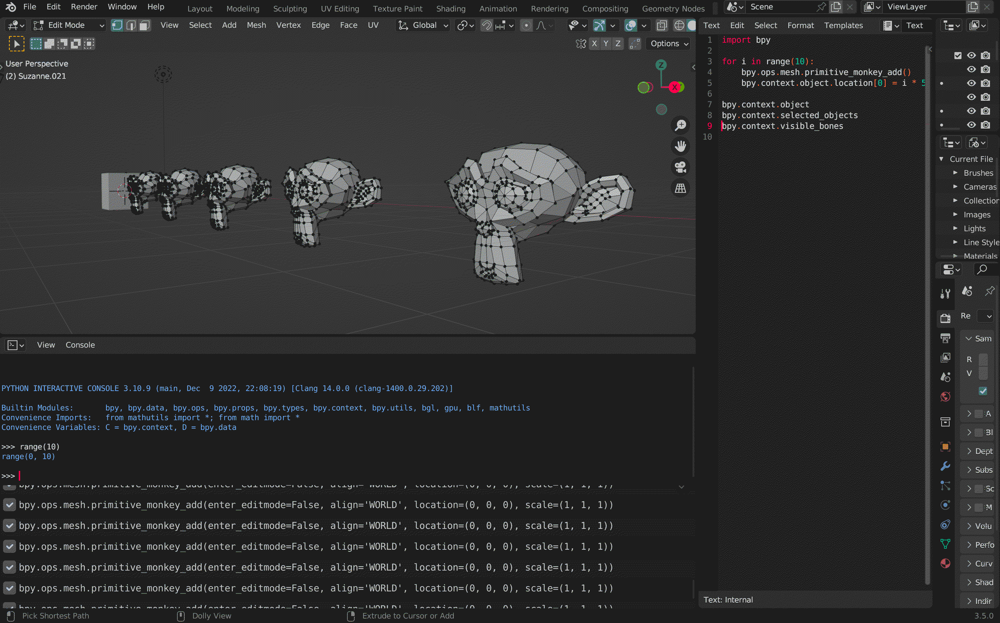

---
hide:
    - toc
---

#Prototyping for Design

**ROBOT**
Both theoretical and practical aspect about using a Robot. Completely new topic for me.
A robot works in linear and in joint-movements.
IaaC robot works in 7 dimensions.

# BLENDER
Why using Blender? This is how the class started. The point that I agree the most with is that blender is built by a community and that's why it has more potential, and also I think it has an horizontal communication and accessibility.
Also, in Blender the priority is the design, not the profit and not just the design that we create but also the possibility to shape the design of the tool itself.
Victor introduced us to Roosendaal, I knew the studio before but I didn't know about the fact that he started and released Blender.
When the propaganda was over (just kidding, it was a great ethical introduction on the software) we were introduced to the interface, the system, the properties and the personalisation (a complete new topic for me since that I'm used to Adobe...)

**Playing with Suzanne**

**Phyton and Blender**
First we connected one phone to blender in order to rotate Suzanne, poor monkey, by the movement of our phones. The signal was sent by wifi connection.
the code for making suzanne rotating by rotating the (andrid)phone. Important is to change the host and prt accrdingly.

import bpy
import socket

# Setup UDP socket
host = '192.168.0.12' # The same address of your computer
port = 5555
s = socket.socket(socket.AF_INET, socket.SOCK_DGRAM)
s.setsockopt(socket.SOL_SOCKET, socket.SO_REUSEADDR, 1)
s.setsockopt(socket.SOL_SOCKET, socket.SO_BROADCAST, 1)
s.bind((host, port))
s.settimeout(1)

# Receive data
try:
    message, address = self.s.recvfrom(8192)

    # Check if the data is complete (sometimes the app sends only some of the sensors)
    if len(message.split(b',')) == 17:

    x = float(message.split(b',')[-2]) * 0.01745
    y = float(message.split(b',')[-1]) * 0.01745
    z = float(message.split(b',')[-3]) * 0.01745
    # print(x,y,z)

    context.object.rotation_euler.x = x
    context.object.rotation_euler.y = y
    context.object.rotation_euler.z = z
except:
    # Stop if no more data is received
    self.cancel(context)
    return {'CANCELLED'}

def execute(self, context):
        wm = context.window_manager
        self._timer = wm.event_timer_add(0.001, window=context.window)
        wm.modal_handler_add(self)
        return {'RUNNING_MODAL'}

Then we also used Arduino in order to give light to a LED string:

#include <Adafruit_NeoPixel.h>

#define PIN 12
#define NUMPIXELS 60
Adafruit_NeoPixel pixels(NUMPIXELS, PIN, NEO_GRB + NEO_KHZ800);

int value = 0;

void setup() {
  Serial.begin(115200);
  pixels.begin();
}

void loop() {

  if (Serial.available()) value = Serial.parseInt();
  while (Serial.available()) Serial.read();

  for(int i=0; i<NUMPIXELS; i++) {
    if (i == value) {
       pixels.setPixelColor(i, pixels.Color(0, 250, 0));
    } else if (abs(i - value) == 1) {
       pixels.setPixelColor(i, pixels.Color(0,15, 0));
    } else if (abs(i - value) == 2) {
       pixels.setPixelColor(i, pixels.Color(0, 1, 0));
    } else {
       pixels.setPixelColor(i, pixels.Color(0, 0, 0));
    }
    pixels.show();
  }

  delay(20);
}

