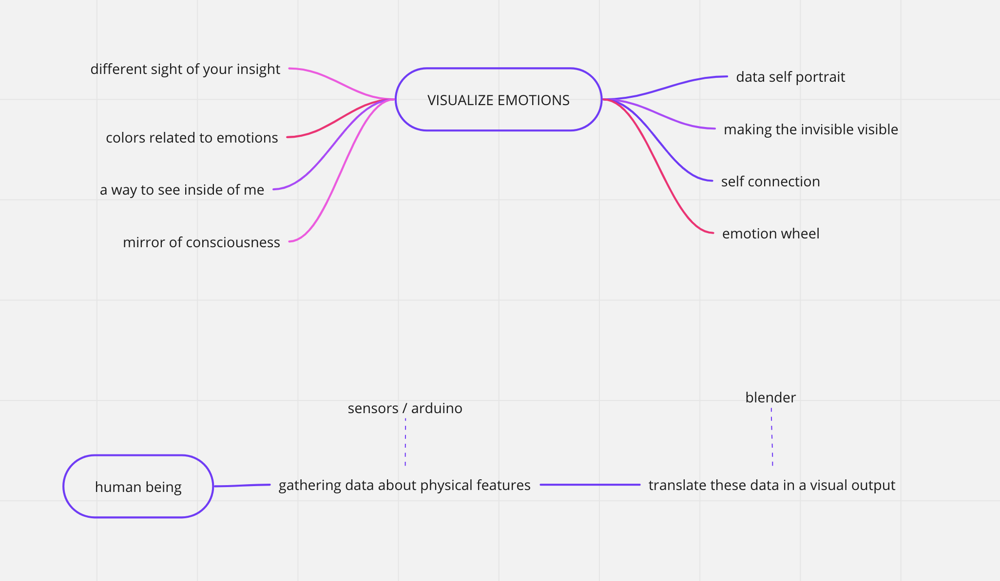
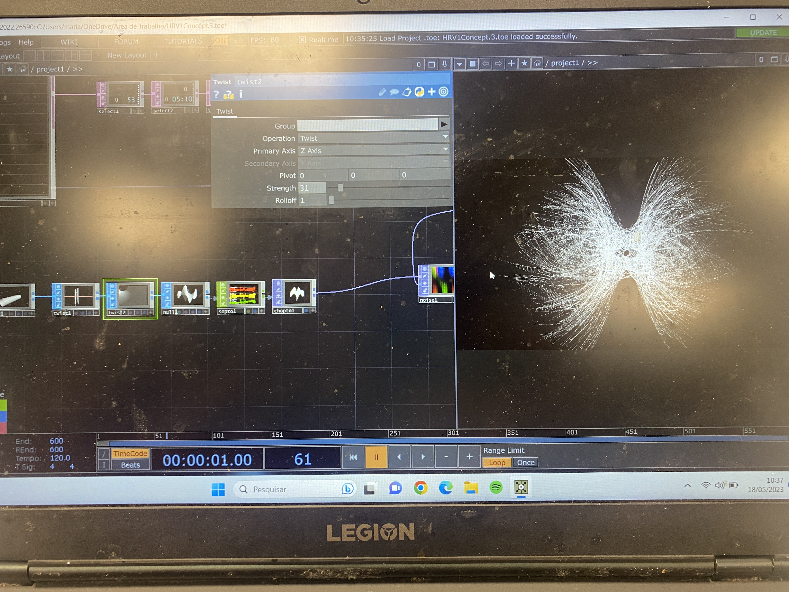

---
hide:
    - toc
---

#Design Studio III

**Reflections**

The last term, which in a way felt very short because I found myself with many things to work on, was very sperimental (finally hands on!) and got me to the point of facing reality in multiples ways:
- Nothing is still, everything keeps evolving:
for the first time I worked as almost a full
time job on a project, and I was surprised by the fact that every time that we felt that we arrived somewhere, everything was changing again: us, our ideas, the project itself. Unfolding Conversations evolved day by day and us with it. Sometimes this process was frustrating because it never gave us time to rest, on the other hand it was really satisfying to face all this issues and, in a way or another, always sorting them out.
P.S. Unfolding Conversations is still work in progress!
- Working opportunities: deciding to submit the application to Sonar helped us to push
the project further and to work with a lot of effort on it, also jumping on stuff that we didn’t know before and so developing new skills; on the other hand, being rejected was a punch in the face, especially after all the effort. We were hoping to give life to Unfolding Conversations and show it to a wide public but, for now, this won’t happen. Facing this limit is challenging but also educating.

**LOOKING FORWARD**
Mariana and I will keep work on it. The time off in El Hierro helped us to clear off our thoughts about it and now we have more ideas that we will try to develop.
I guess that my identity changed in a way
that managed to adapt to many different challenges and opportunities, and this made even more clear who I want to be as a designer, what I want to focus on and what I seek for myself as a person and my career.
I want to keep work on social issues, related to the context that I’m living in, in order to face with a first person perspective and then explore it throughout autoethnographic research and radical situatedness.
I want to be active participant.

**Alternative Presents**
Throughout our third intervention we manage to create a collective, but personal, space for people in order to support our alternative present. The Confessional gave people the opportunity to reflect, open up and talk about drug experiences but still respecting privacy, so in a private and anonymous way.
Also the stickers around the city connected to the Google Form was a way to break a wall, increase the dialogue, have people feel comfortable with sharing personal experiences.
These processes are the first part of our strategy for creating Alternative Presents: we first gathered data, engaged with people, saw and studied reactions, to be more aware on how to move further.

Engaging with the citizens of Barcelona is still part of the next steps of our project. Since that the topic is radical, not often spoken about and might be also disturbing for some people, we decided to surf the wave and focus on two specific ways of engagement:
- Base our actions on data: this approach can allow us to be objective and honest and drug assumption.
- Guerrilla marketing: we don’t want to hurst the sensibility of no one, so we thought that guerilla might be a good solution for us,
as it leaves to people the freedom and the decision to approach the topic, or to leave if not interested. This also automatically create an audience, and then a community, of people actually interested and that want to be involved.

# A new perspective

A new collaboration is born and it's taking the project to a new development, still connected with sharing / inner world / giving space / personalise but using the body as a medium...

THE CONCEPT

Talking about emotions it's a task that can be hard to achieve. Digging inside of ourselves and explore our inner feelings needs a lot of efforts and self awareness + support from others.
What if we had a way to visualise emotions with shapes and colours? See how they move around, how they interact with time and space and mostly, for once, seeing them outside of our body without speaking?
There's no need to explain, sometimes just an overview can help to reconnect with ourselves.

Our interests overlapped in concepts surrounding mental and physical health, and a more holistic perspective on wellness. We discussed the wisdom that our bodies hold, and their constant expression of feeling. It is important to listen to our bodies and follow what they desire if we want to enjoy living well. So, we decided to prototype a biofeedback device that aids in understanding information that our nervous systems are transmitting so as to provide tools to improve wellbeing. We thought, what if we can visualize clearly what our nervous system is expressing? Can this help us to control our bodily states and the way our minds interpret existence?

We decided to explore this concept by building a model that visualizes Heart Rate Variability (HRV). HRV is the amount of time between heartbeats, which vary constantly depending on the state of balance of the nervous system. Both sympathetic and parasympathetic nervous systems are competing against each other, and the result from this balancing equation provides a value in ms. A higher value usually indicates a more balanced nervous system, while a lower value might indicate that one either sympathetic or parasympathetic system is dominating. This is expected while exercising, for instance, but might not be beneficial while sleeping. Since it is highly influenced by our nervous system, this implies that HRV represents valuable information transmitted to our brain on how our bodies should react to the stimuli it is exposed to. This could include the environment we are in, what we are feeling, what we are thinking, the people around us or the activities we engage in. There are many other types of biofeedback data that could also be considered, but we understand that HRV is easy to measure and provides comprehensive information.

If we could visualize HRV in real time, can we learn how to achieve balance?

By collecting heart rate data from ECG sensors, calculating HRV of a user, and visualizing this information in an engaging format, we could allow users to understand their bodily states and redirect them towards states of higher benefit.

HRV stands for Heart Rate Variability, and it is a measure of the variation in the time intervals between consecutive heartbeats. It is an important physiological indicator that provides insights into the health and functioning of the autonomic nervous system, which regulates various bodily functions.
The primary goal of HRV analysis is to assess the physiological state of an individual and provide insights into their autonomic nervous system function, stress levels, and overall health. It is often used in medical and research settings, sports science, and other fields where objective measurements and data-driven analysis are crucial.
We're working on a multidisciplinary approach to provide insights to a holistic concept for wellbeing.
Why so?
The objective is to achieve a sense of equilibrium and enter a state of flow. This can be accomplished by connecting with our inner wisdom and becoming attuned to the signals our bodies are sending us. By implementing techniques to biohack in order to optimize our nervous system and induce relaxation, rather than remaining in a heightened state of alertness, we can enhance our well-being. One effective method to achieve this is resonance frequency breathing, where we synchronize our breathing with our heart rate, resulting in a state known as coherence. Coherence boosts heart rate variability (HRV), which in turn facilitates the state of flow and equilibrium. By utilizing this biofeedback technique, we can make more informed decisions regarding our overall well-being.
The general interpretation of the results is typically done in a quantified manner but these objective measurements can indirectly inform emotional and psychological states since HRV is influenced by factors such as stress, relaxation, and emotional arousal.
HRV is widely used in research, sports science, and healthcare to assess cardiovascular health, stress levels, emotional states, and overall well-being. It can provide valuable information about the body's physiological response to stress, exercise, recovery, and other factors.
The data analysis of HRV typically focuses on algorithmic measurements rather than emotional or empathetic aspects. HRV analysis involves mathematical algorithms, statistical methods, and established scientific guidelines to extract meaningful information from the data.
Our goal is to combine HRV analysis with visual art to gain a more comprehensive, accessible and holistic understanding of an individual's emotional and empathetic state.
Biofeedback is a technique that involves monitoring and providing real-time feedback about certain physiological processes in the body. It allows individuals to gain awareness and control over bodily functions that are typically involuntary. The feedback provided in biofeedback sessions can be visual, auditory, or tactile, allowing individuals to observe and learn how their body responds to different situations or stimuli. By becoming aware of these bodily responses, individuals can then consciously work to modify or regulate them. Biofeedback is often used as a therapeutic tool to help manage stress, anxiety, pain, and other health conditions. It enables individuals to learn self-regulation techniques and gain better control over their physical and mental well-being.

Data is more than just numbers. With this installation we aim for:
Emotional expression: visual art has the potential to convey emotions in a powerful and expressive way. And we'll make it personal. By combining HRV analysis with visual art, individuals can use art as a tool for visualizing their interior flow, allowing for a deeper exploration, connection and communication of their experiences.
Subjective interpretation: HRV analysis provides objective data, but the interpretation of that data can be subjective by incorporating visual art. This subjective interpretation allows for a more personalized understanding of their emotional and empathetic state.
Accessibility and engagement: visual art has the advantage of being accessible and engaging to a wide range of people, including those who may not have a scientific background or understand the technical aspects of HRV analysis. Art can serve as a bridge, making complex physiological information more accessible and relatable to a broader audience.
Multidimensional representation: by combining HRV analysis with visual art we aim to create a multidimensional aspect to the understanding of emotional and empathetic states. HRV provides quantitative physiological data, while visual art adds a qualitative and sensory dimension that aids interpretation. This multidimensional representation can provide a richer and more nuanced understanding of individuals's health.
Therapeutic benefits: engaging with health by developing a holistic expression can have therapeutic benefits, promoting self-reflection, emotional processing, and stress reduction.

#THE MUTUAL INSTALLATION

body sensors - human being - real time data processing - sync (coherence)
connection with the body / sync with another body / environment

a legend of colors: to work on
create an environment that also helps to raise the HRV (resonance frequency breathing, hugs, etc. — to work on list of resources to increase hrv)
a structure for to projectors (work on it after that we see the space and the projectors that we will use)

The goal for the user is to enter into a state of coherence through collaboration with a peer and parasympathetic stimulation techniques and resources.  increase the HRV and to co-align it with the respiratory rate of a peer, sitting in front. The lights projected from the top of each user will guide them throughout the experience.

Connect to sensors.
Sit down on a meditation pillow.
Turn on HRV “aura” display (projected visual of hrv through color).
Begin “RFB” and coherence collaboration.
Visualize HRV transformation through color.
Record all HRV sensor data and display through an interface.
for viewers to watch in real-time
for participants to watch post-activity
Finalize interaction and provide feedback/insights.

#THE DATA SCULPTURE

polar sensors - python script for interpretation - interface built on python - API - touch design

